# 充值活动 PRD 重写版

文档版本：V1.0 重写版  
生成时间：2026-05-08 18:41:34  
文档状态：待产品确认 / 待开发评审  
适用产品：Stay / Recharge Activity  
时区口径：UTC+3

---

## 0. 文档说明

### 0.1 重写背景

原始材料能看出活动方向，但写法太散：页面描述多，业务规则少；奖励写了，但发放方式、失败处理、客服核销没闭环；榜单写了，但排序、快照、历史追溯没定义；充值口径混用了“充值金额 / 金币到账 / 币商充值 / 代理水晶”；分区只写一句，没贯穿榜单和奖励。

本 PRD 按“开发能实现、测试能验收、运营能对账、客服能解释”的标准重写。

### 0.2 输入材料

| 材料 | 路径 | 用途 |
|---|---|---|
| 活动总览 PDF | `/Users/mac/Downloads/充值活动/stay项目组.pdf` | 活动入口、奖励页、统计规则、Top3 规则 |
| 榜单页 PDF | `/Users/mac/Downloads/充值活动/充值页面-榜单.pdf` | 周/月榜单、倒计时、Top20、我的排名条 |
| 历史榜单 PDF | `/Users/mac/Downloads/充值活动/充值页面-榜单历史.pdf` | 周历史、月历史展示范围 |
| 充值档位 PDF | `/Users/mac/Downloads/充值活动/充值档位.pdf` | 日/周/月档位奖励与排行奖励配置 |
| 逻辑审计报告 | `/Users/mac/Downloads/充值活动/充值活动需求分析与逻辑坑点报告.md` | P0/P1 冲突与暗坑 |
| 流程图与坑点表 | `/Users/mac/Downloads/充值活动/充值活动业务流程图与坑点表.md` | 业务流程、推荐规则、落库建议 |
| 后台资产赠送原型 | `/Users/mac/Downloads/充值活动/原型图/后台-平台管理-资产赠送.jpg` | 平台管理后台资产赠送弹窗，补充"线下充值"赠送原因 |
| 后台资产扣除原型 | `/Users/mac/Downloads/充值活动/原型图/微信图片_20260514180516_57_114.png` | 平台管理后台资产扣除弹窗，新增"充值活动扣除"扣除原因 |


### 0.3 材料盘点与原型映射（按 prd-from-brainmaps-and-prototypes skill 执行）

#### 0.3.1 材料盘点

| 类型 | 文件/目录 | 处理方式 | 结论 |
|---|---|---|---|
| 活动总览 PDF | `stay项目组.pdf` | 提取内嵌原型图并切割 | 作为 Recharge Reward / Rule / Progress / Top3 的主源 |
| 榜单页 PDF | `充值页面-榜单.pdf` | 提取完整原型图 | 作为 Recharge Ranking 模块主源 |
| 历史榜单 PDF | `充值页面-榜单历史.pdf` | 提取完整原型图 | 作为历史榜单模块主源 |
| 充值档位 PDF | `充值档位.pdf` | 提取配置表 | 作为档位奖励、排行奖励配置源 |
| 逻辑审计报告 | `充值活动需求分析与逻辑坑点报告.md` | 作为冲突与坑点修正依据 | 不作为页面结构主源 |
| 流程图与坑点表 | `充值活动业务流程图与坑点表.md` | 作为服务端流程与异常补充依据 | 不替代原型页面 |
| 切割输出 | `原型图/` | 作为 PRD 内插图目录 | 图片必须放到对应模块，不做总览堆图 |

#### 0.3.2 原型图到功能模块映射

| 原型切图 | 类型 | 对应 PRD 模块 | 放置原则 |
|---|---|---|---|
| `01_首页_Daily充值奖励完整画板.png` | 独立页面 / 状态 | 8. Recharge Reward 充值奖励页 | Daily 状态说明下方 |
| `02_首页_Weekly充值奖励完整画板.png` | 独立页面 / 状态 | 8. Recharge Reward 充值奖励页 | Weekly 状态说明下方 |
| `03_首页_Monthly充值奖励完整画板.png` | 独立页面 / 状态 | 8. Recharge Reward 充值奖励页 | Monthly 状态说明下方 |
| `04_Rule规则页完整画板.png` | 独立页面 | 14. Rule 规则页 | Rule 页面内容下方 |
| `05_DailyProgress_12_5m弹窗.png` | 独立弹窗状态 | 9. 档位奖励规则 | Daily 低档位奖励说明下方 |
| `06_DailyProgress_25m弹窗.png` | 独立弹窗状态 | 9. 档位奖励规则 | Daily 高档位奖励说明下方 |
| `07_DailyTop3奖励说明弹窗.png` | 独立组件状态 | 10. Top3 达标榜 | Daily Top3 展示规则下方 |
| `08_WeeklyProgress_125m弹窗.png` | 独立弹窗状态 | 9. 档位奖励规则 | Weekly 档位奖励说明下方 |
| `09_WeeklyTop3奖励说明弹窗.png` | 独立组件状态 | 10. Top3 达标榜 | Weekly Top3 展示规则下方 |
| `10_MonthlyProgress_300m弹窗.png` | 独立弹窗状态 | 9. 档位奖励规则 | Monthly 档位奖励说明下方 |
| `11_MonthlyTop3奖励说明弹窗.png` | 独立组件状态 | 10. Top3 达标榜 | Monthly Top3 展示规则下方 |
| `12_充值页面_榜单完整原型图.png` | 独立页面 | 11. Recharge Ranking 排行榜页 | 榜单页面结构下方 |
| `13_充值页面_榜单历史完整原型图.png` | 独立页面 | 13. 历史榜单页 | 历史榜单页面结构下方 |
| `14_充值档位配置表.png` | 配置表 | 9. 档位奖励规则 | 档位配置字段下方 |
| `15_充值奖励配置大表.png` | 配置表 | 18. 后台与运营能力要求 | 后台配置能力下方 |
| `后台-平台管理-资产赠送.jpg` | 后台弹窗 | 18.3 资产赠送 | 资产赠送弹窗说明下方 |
| `微信图片_20260514180516_57_114.png` | 后台弹窗 | 18.4 资产扣除 | 资产扣除弹窗说明下方 |

切割校验文件：`/Users/mac/Downloads/充值活动/原型图/00_切割校验总览.png`  
裁切元数据：`/Users/mac/Downloads/充值活动/原型图/crop_metadata.json`

### 0.4 采用原则

| 优先级 | 来源 | 说明 |
|---:|---|---|
| 1 | 本 PRD 重写规则 | 用于开发实现的最终闭环规则 |
| 2 | 已生成逻辑审计报告 | 用于修正原文冲突 |
| 3 | 原型 PDF 可见结构 | 页面结构与字段来源 |
| 4 | 原始文案 | 仅作为素材，不照抄模糊规则 |

---

## 1. 产品目标与范围

### 1.1 产品目标

通过 Recharge Activity 刺激用户充值，提供三类激励：

1. Daily / Weekly / Monthly 累计充值档位奖励。
2. 当前档位最先达成 Top3 展示，制造即时竞争感。
3. Weekly / Monthly 充值排行榜奖励，刺激高额用户冲榜。

### 1.2 本期范围

| 模块 | 是否包含 | 说明 |
|---|---:|---|
| 活动入口 | 是 | 首页 Banner、房间悬浮窗 |
| Recharge Reward 奖励页 | 是 | 默认落地页 |
| 日/周/月档位奖励 | 是 | 每日0点发放昨日/本周/本月达标奖励 |
| Top3 达标榜 | 是 | 当前档位最先达成前三名 |
| Recharge Ranking 排行榜页 | 是 | Weekly / Monthly Ranking |
| 历史榜单页 | 是 | 近 3 周、近 3 月 |
| Rule 规则页 | 是 | 活动规则、统计口径、领取说明 |
| 英语区/阿语区分区 | 是 | 榜单、奖励、历史均按区独立 |
| 客服/运营核销 | 是 | 作为后台能力要求，不细化后台 UI |
| 完整后台管理系统 | 否 | 本 PRD 只定义必要配置、核销、对账能力 |

---

## 2. 核心业务链路

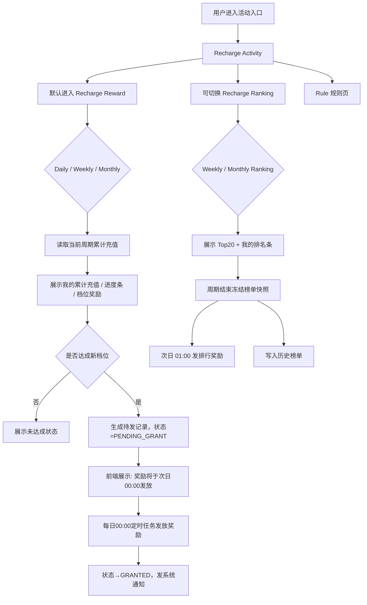
```mermaid
flowchart TD
    A[用户进入活动入口] --> B[Recharge Activity]
    B --> C[默认进入 Recharge Reward]
    B --> D[可切换 Recharge Ranking]
    B --> R[Rule 规则页]

    C --> C1{Daily / Weekly / Monthly}
    C1 --> C2[读取当前周期累计充值]
    C2 --> C3[展示我的累计充值 / 进度条 / 档位奖励]
    C3 --> C4{是否达成新档位}
    C4 -->|否| C5[展示未达成状态]
    C4 -->|是| C6[生成待发记录，状态=PENDING_GRANT]
    C6 --> C7[前端展示: 奖励将于次日00:00发放]
    C7 --> C8[每日00:00定时任务发放奖励]
    C8 --> C9[状态→GRANTED，发系统通知]

    D --> D1{Weekly / Monthly Ranking}
    D1 --> D2[展示 Top20 + 我的排名条]
    D2 --> D3[周期结束冻结榜单快照]
    D3 --> D4[次日 01:00 发排行奖励]
    D3 --> D5[写入历史榜单]
```

### 2.1 核心闭环

```text
有效金币到账事件
→ 按 UTC+3 落入日/周/月周期
→ 按用户分区累计
→ 触发档位达成判断
→ 生成待发记录，状态=PENDING_GRANT
→ 前端展示"已达标，奖励将于次日00:00发放"
→ 每日00:00定时任务发放达标奖励
→ 奖励发放成功后状态→GRANTED，发系统通知
→ 历史榜单、通知、客服对账读取同一套记录
```

---

## 3. 活动配置规则

### 3.1 基础配置表

| 字段 | 类型 | 必填 | 示例 | 说明 |
|---|---|---:|---|---|
| 活动ID（activity_id） | string | 是 | recharge_202605 | 活动唯一 ID |
| 活动名称（activity_name） | string | 是 | Recharge Activity | 前端标题 |
| 时区（timezone） | string | 是 | UTC+3 | 固定使用 UTC+3 |
| 活动开始时间（start_time） | datetime | 是 | 2026-05-08 00:00:00 | 活动开始时间 |
| 活动结束时间（end_time） | datetime | 是 | 2026-05-31 23:59:59 | 活动结束时间 |
| 展示截止时间（display_end_time） | datetime | 是 | 2026-06-07 23:59:59 | 活动展示截止 |
| 人工权益领取截止时间（reward_deadline） | datetime | 是 | 2026-06-10 23:59:59 | 人工权益领取/核销截止 |
| 支持分区（enabled_regions） | array | 是 | EN, AR | 支持分区 |
| 默认落地页（default_landing_tab） | enum | 是 | Recharge Reward | 默认落地页 |
| 活动状态（status） | enum | 是 | Draft/Online/Ended/Archived | 活动状态 |

### 3.2 活动状态机

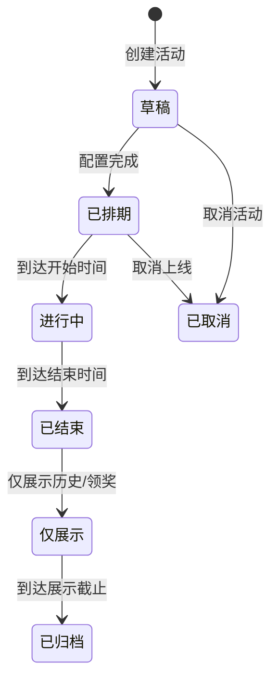
```mermaid
stateDiagram-v2
    [*] --> 草稿: 创建活动
    草稿 --> 已排期: 配置完成
    已排期 --> 进行中: 到达开始时间
    进行中 --> 已结束: 到达结束时间
    已结束 --> 仅展示: 仅展示历史/领奖
    仅展示 --> 已归档: 到达展示截止
    草稿 --> 已取消: 取消活动
    已排期 --> 已取消: 取消上线
```

### 3.3 状态规则

| 状态 | 用户可见 | 累计充值 | 档位奖励 | 排行奖励 | 说明 |
|---|---:|---:|---:|---:|---|
| 草稿 | 否 | 否 | 否 | 否 | 配置中 |
| 已排期 | 可选预热 | 否 | 否 | 否 | 未到开始时间 |
| 进行中 | 是 | 是 | 是 | 是 | 活动进行中 |
| 已结束 | 是 | 否 | 否 | 是 | 停止累计，允许排行发奖 |
| 仅展示 | 是 | 否 | 否 | 否 | 仅查看历史和领取人工权益 |
| 已归档 | 否 | 否 | 否 | 否 | 归档 |
| 已取消 | 否 | 否 | 否 | 否 | 取消 |

---

## 4. 时间与周期规则

### 4.1 统一时区

活动所有统计、展示、倒计时、周期结算、奖励发放均以 UTC+3 为准。

### 4.2 周期定义

所有周期采用左闭右开区间，包含开始时间，不包含结束时间。

| 周期 | 统计窗口 | 周期 ID 示例 | 说明 |
|---|---|---|---|
| Daily | `[当日 00:00:00, 次日 00:00:00)` | 2026-05-08 | 每日独立统计 |
| Weekly | `[周一 00:00:00, 下周一 00:00:00)` | 2026-W19 | 周一为周开始 |
| Monthly | `[当月 1 日 00:00:00, 次月 1 日 00:00:00)` | 2026-05 | 自然月 |

### 4.3 活动有效期交集

若自然周期与活动有效期不完全重合，实际统计窗口取交集。

```text
实际统计窗口 = 自然周期窗口 ∩ 活动有效期窗口
```

| 场景 | 活动开始/结束 | 自然周期 | 实际统计窗口 |
|---|---|---|---|
| 活动中途上线 | 5月8日 15:00 | 5月8日 Daily | `[5月8日 15:00, 5月9日 00:00)` |
| 活动月底结束 | 5月20日 23:59:59 | 5月 Monthly | `[5月1日 00:00, 5月20日 23:59:59]` |
| 活动覆盖整月 | 5月1日 00:00 ~ 6月1日 00:00 | 5月 Monthly | `[5月1日 00:00, 6月1日 00:00)` |

---

## 5. 分区规则

### 5.1 分区定义

| 分区编码 | 分区名称 | 说明 |
|---|---|---|
| EN | English Region | 英语区 |
| AR | Arabic Region | 阿语区 |

### 5.2 分区来源

用户活动分区以后台用户分区配置为准，不随前端语言切换实时变化。

优先级：后台用户活动分区配置 > 用户注册地区映射 > 用户当前主要语言映射 > 默认 EN。

### 5.3 分区影响范围

| 模块 | 是否按分区独立 | 规则 |
|---|---:|---|
| Recharge Reward 奖励页 | 是 | 用户看到自己分区的累计、档位和 Top3 |
| Top3 达标榜 | 是 | EN/AR 各自独立 |
| Weekly Ranking | 是 | EN/AR 各自独立 |
| Monthly Ranking | 是 | EN/AR 各自独立 |
| 排行奖励 | 是 | EN/AR 分别发 Top1 / Top2-3 / Top4-8 |
| 历史榜单 | 是 | EN/AR 分区保存和展示 |
| 首页顶部当月 Top1 | 是 | 展示当前用户分区的月 Top1 |
| 后台配置 | 可选 | 奖励配置可全区共用，也可按区单独配置 |

### 5.4 分区变更与跨区累计规则

**核心原则：不同分区的充值金额独立统计，互不合并。**

用户在不同分区的充值行为各自累计、各自达档、各自发奖。用户不会因为在一个分区充值而在另一个分区获得档位奖励。

| 场景 | 处理规则 |
|---|---|
| 同一用户同一天在 AR 区充值 1000 美元、EN 区充值 2000 美元 | AR 区记录 1000 美元等值金币累计，EN 区记录 2000 美元等值金币累计，**不合并** |
| 用户周期内分区变更 | 变更后新到账金币计入新分区；变更前已产生累计留在原分区，不追溯迁移 |
| 已冻结周期 | 不随用户分区变更重算 |
| 用户切换 App 语言 | 不影响活动分区 |
| 用户分区为空 | 按兜底规则分配 |

**跨区示例：**

| 时间 | 事件 | EN 区累计 | AR 区累计 | EN 档位达成 | AR 档位达成 |
|---|---|---:|---:|---|---|
| 周一 10:00 | EN 区充值 300 万金币 | 3,000,000 | 0 | 50万 ✅ 100万 ✅ 150万 ✅ 300万 ✅ | 无 |
| 周一 15:00 | AR 区充值 100 万金币 | 3,000,000 | 1,000,000 | 同上 | 50万 ✅ 100万 ✅ |
| 周二 09:00 | AR 区再充 200 万金币 | 3,000,000（新日周期从 0） | 3,000,000（新日周期从 0，周/月继续累计） | 周二新日周期重新累计 | 50万 ✅ 100万 ✅ 150万 ✅ 300万 ✅ |

**说明：** 各分区独立累计→独立判断档位达成→独立发奖。分区变更后幂等键中分区字段改变，但同一周期同一分区同一档位仍然只发一次。

---

## 6. 充值统计口径

### 6.1 核心规则

活动累计充值以“有效金币到账事件”为唯一统计依据。

统计对象为金币接收方用户。

有效来源包括但不限于：官方充值、第三方充值链接充值、币商交易、币商给自己充值、通过他人/自己预支或借支充值金币、提现转金币、钻石兑换金币、运营后台线下充值类型加币成功。

不直接以支付订单金额、美元金额、水晶消耗量作为排名与档位判断依据；只有最终形成金币到账事件，才进入活动累计。

<span style="color:red"><strong>【充值来源红线】除本章节明确指定计入充值活动的金币来源外，其他金币来源一律不计入充值活动累计。例如：幸运礼物返币、金币红包、活动奖励金币、运营补偿金币、测试加币、人工调账金币等，均不计入档位奖励、Top3达标榜、Weekly/Monthly排行榜和排行奖励。</strong></span>

### 6.2 计入规则表

| 事件类型 | 金币接收方 | 来源方 | 是否计入 | 计入对象 | 说明 |
|---|---|---|---:|---|---|
| 官方应用内充值 | 任意有效用户 | 官方支付渠道 | 是 | 接收方用户 | 按金币到账时间计入 |
| 第三方充值链接充值金币 | 任意有效用户 | 第三方支付链接 | 是 | 接收方用户 | 通过第三方支付链接完成充值，金币到账后计入 |
| 普通用户通过币商买金币 | 普通用户 | 币商/代理 | 是 | 接收方用户 | 用户真实获得金币 |
| 币商卖金币给普通用户 | 普通用户 | 币商 | 是 | 普通用户 | 卖方不计入，接收方计入 |
| 币商给自己充值金币 | 币商本人 | 币商本人/币商账户 | 是 | 币商本人 | 只要产生有效金币到账，就进入充值累计 |
| 通过他人预支/借支充值金币 | 借入方/接收方 | 他人账户/借支账户 | 是 | 接收方用户 | 按最终金币到账接收方计入，不按资金出借方计入 |
| 通过自己预支/借支充值金币 | 本人 | 本人预支/借支额度 | 是 | 本人 | 预支/借支本质产生金币到账，计入活动累计 |
| 提现转为金币 | 本人 | 提现余额/可提现资产 | 是 | 本人 | 提现金额兑换/转入金币后，按金币到账时间计入 |
| 钻石兑换金币 | 本人 | 钻石余额 | 是 | 本人 | 钻石兑换形成金币到账后计入 |
| 代理水晶充值 | 代理/币商 | 水晶账户 | 否 | 无 | 仅水晶侧变动不计入；若最终兑换/充值为金币到账，则按对应金币到账事件计入 |
| 运营后台加金币：线下充值 | 任意有效用户 | 运营后台 | 是 | 接收方用户 | 运营后台选择“线下充值”类型并加币成功后，视为有效金币到账事件，按接收方用户计入活动累计 |
| 运营后台加金币：其他类型 | 任意用户 | 运营后台 | 否 | 无 | 除“线下充值”以外的后台加金币类型均不计入活动累计，例如补偿、测试、调账、活动赠送、人工修正等 |
| 退款/撤销订单 | 原用户 | 原订单 | 回滚 | 原用户 | 扣减或进入风控流程 |
| 风控判定无效 | 任意用户 | 任意来源 | 否 | 无 | 不参与活动 |
| 其他金币来源 | 任意用户 | 幸运礼物返币/金币红包/活动奖励金币/运营补偿/测试加币/人工调账等 | 否 | 无 | <span style="color:red"><strong>除本表明确写明计入的金币来源外，其他金币来源一律不计入充值活动。</strong></span> |

### 6.3 充值事件字段

| 字段 | 类型 | 必填 | 说明 |
|---|---|---:|---|
| 事件ID（event_id） | string | 是 | 金币到账事件 ID |
| 用户ID（user_id） | string | 是 | 金币接收方 |
| 到账金币数（amount_coin） | integer | 是 | 到账金币数 |
| 来源类型（source_type） | enum | 是 | official / third_party_link / merchant_trade / merchant_self_recharge / advance_credit / loan_credit / withdrawal_to_coin / diamond_exchange / offline_recharge / crystal / operation / refund |
| 卖方ID（seller_user_id） | string | 否 | 币商/卖方 |
| 买方ID（buyer_user_id） | string | 否 | 买方 |
| 接收方账号类型（receiver_account_type） | enum | 是 | normal / agent / merchant / official |
| 是否有效（is_valid） | boolean | 是 | 是否有效 |
| 无效原因（invalid_reason） | string | 否 | 退款/撤销/风控/异常 |
| 到账时间（arrived_at） | datetime | 是 | 金币到账时间，按 UTC+3 入周期 |
| 原始订单ID（raw_order_id） | string | 是 | 原始订单 ID |
| 活动分区（region） | enum | 是 | 到账时用户活动分区 |

### 6.4 退款 / 撤销 / 风控处理

| 场景 | 累计值处理 | 奖励处理 | 榜单处理 |
|---|---|---|---|
| 周期内退款，奖励未发 | 扣减累计 | 不发 | 实时榜单更新 |
| 周期内退款，奖励已发 | 扣减累计 | 自动追回/冻结/人工审核 | 实时榜单更新 |
| 周期结束后退款，排行已发 | 不直接改快照，追加异常标记 | 进入风控追回 | 历史保留并标记 |
| 风控刷榜 | 清空或扣减活动数据 | 取消资格/追回奖励 | 从实时榜移除或标记 |
| 金币到账失败 | 不计入 | 不发 | 不上榜 |

---

## 7. 活动入口与页面导航

### 7.1 入口

| 入口 | 展示位置 | 点击行为 |
|---|---|---|
| 首页顶部 Banner | 首页顶部运营位 | 点击进入 Recharge Activity |
| 房间悬浮窗 | 房间页悬浮入口 | 点击进入 Recharge Activity |

### 7.2 默认落地页

用户从任意入口进入活动页，默认进入 `Recharge Reward` 页。

### 7.3 页面顶部结构

| 元素 | 规则 |
|---|---|
| 返回按钮 | 点击返回上一级页面 |
| 标题 | Recharge Activity |
| Rule 按钮 | 点击进入规则页 |
| 顶部 Top1 区域 | 固定展示当前用户分区的当月充值榜 Top1 |

### 7.4 顶部当月 Top1

| 场景 | 展示规则 |
|---|---|
| 当前分区当月有榜单数据 | 展示 Top1 用户头像、昵称 |
| 当前分区当月暂无榜单数据 | 头像展示占位图，昵称展示 `Waiting For You` |
| 用户切换 Daily/Weekly/Monthly | 顶部 Top1 不变化 |
| 用户分区为空 | 按兜底分区展示 |

---

## 8. Recharge Reward 充值奖励页


### 8.0 模块基础信息（按 skill 模板补齐）

#### 模块背景

Recharge Reward 是充值活动的默认落地模块，负责展示用户在 Daily / Weekly / Monthly 三个周期内的累计充值、档位进度、可得奖励与 Top3 达成展示。该模块直接影响用户是否理解“充到多少能拿什么”。

#### 用户场景

| 用户 | 场景 | 目标 |
|---|---|---|
| 普通充值用户 | 从活动入口进入活动页 | 查看当前周期累计充值和下一档奖励 |
| 高额充值用户 | 切换 Weekly / Monthly | 判断是否继续冲档或冲榜 |
| 已达档用户 | 查看奖励区 | 确认奖励是否已发放或需联系客服领取 |

#### 对应原型

**Daily 状态：**

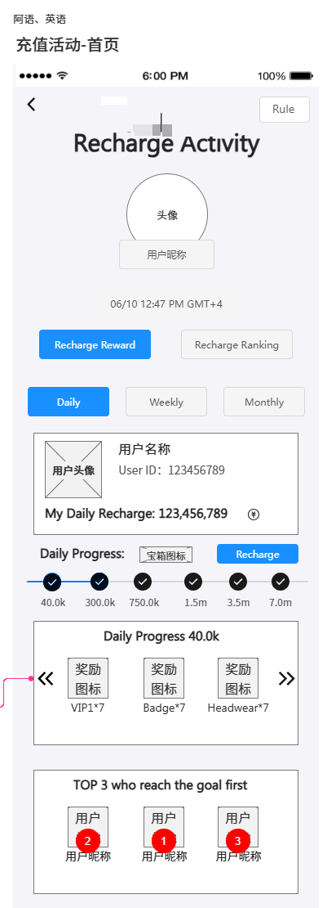

**Weekly 状态：**

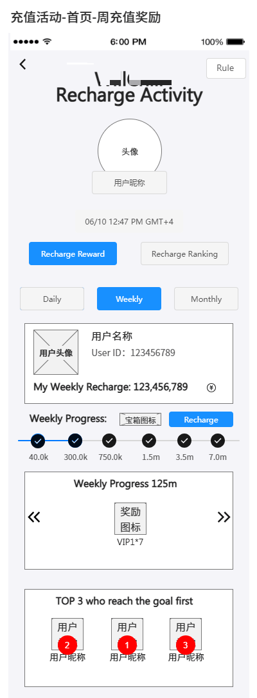

**Monthly 状态：**

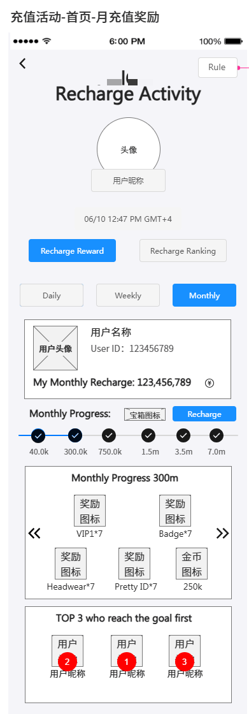

#### 前置条件

- 活动状态为 Online。
- 用户账号未命中活动风控限制。
- 服务端能读取用户分区、周期累计充值、档位配置、奖励发放状态。
- 若用户未登录，页面不得展示个人累计充值与我的排名，只展示活动规则入口或引导登录。

#### 触发方式

| 触发点 | 行为 |
|---|---|
| 活动 Banner / 房间悬浮窗 | 进入 Recharge Activity，默认打开 Recharge Reward |
| 点击 Daily / Weekly / Monthly | 切换周期维度并重新拉取周期累计、档位、Top3 数据 |
| 点击 Rule | 进入 Rule 规则页 |
| 点击 Recharge Ranking | 切换到榜单页 |

#### 字段与数据来源

| 字段 | 说明 | 统计方式 | 数据来源 |
|---|---|---|---|
| `activity_id` | 活动 ID | 当前活动 | 活动配置 |
| `region` | 用户所属分区 | 实时读取当前用户分区 | 用户资料 / 活动分区服务 |
| `period_type` | Daily / Weekly / Monthly | 当前选中周期 | 前端 Tab 状态 |
| `period_start_at` | 周期开始时间 | UTC+3 自然日/自然周/自然月 | 服务端周期计算 |
| `period_end_at` | 周期结束时间 | UTC+3 自然日/自然周/自然月 | 服务端周期计算 |
| `my_recharge_amount` | 我的累计充值 | 当前周期累计有效金币到账 | `recharge_period_summary` |
| `current_tier_amount` | 当前档位门槛 | 当前周期配置 | 档位配置表 |
| `next_tier_amount` | 下一档门槛 | 当前周期配置 | 档位配置表 |
| `progress_percent` | 进度条百分比 | 我的累计充值 ÷ 下一档门槛，最大 100% | 服务端计算后返回 |
| `tier_rewards` | 档位奖励 | 当前周期、当前档位 | 奖励配置表 |
| `grant_status` | 奖励发放状态 | 按档位达成记录实时读取 | `reward_grant` |

口径说明：客户端与后台统计口径一致，均按 UTC+3 周期内“有效金币到账事件”累计，不按订单创建时间、不按支付发起时间。

#### 交互逻辑

- 默认进入 Recharge Reward，默认选中 Daily。
- 用户切换周期时，页面必须刷新：累计充值、进度条、档位节点、奖励区、Top3 达标榜。
- 若请求未返回，保留当前周期旧数据但显示 loading；请求失败时提示重试，不允许把旧周期数据误展示为新周期数据。
- 已达成档位展示达成态；未达成档位展示差额。
- 奖励若为自动发放，前端展示"已发放 / 发放中 / 发放失败"；若为人工权益，展示"联系客服领取 / 已核销 / 已过期"；**已达标但未到发奖时间的，展示"奖励将于次日 00:00（UTC+3）自动发放"**。

#### 服务端核心逻辑

- 所有周期、分区、充值金额、档位判断由服务端计算，前端只展示结果。
- 切换周期时按 活动ID + 用户ID + 分区 + 周期类型 + 周期标识 查询汇总。
- 充值事件到账后异步刷新周期汇总，同时触发档位达成与 Top3 达标判断。
- 服务端必须保证同一用户同一周期同一档位只生成一条达成记录。
- **档位奖励发放时机：每日 00:00（UTC+3）统一发放昨日/本周/本月达标的档位奖励。**
- **发奖时按用户发奖时刻的分区判断，而非充值时刻的分区。**

#### 状态设计

| 状态 | 进入条件 | 页面表现 |
|---|---|---|
| `NOT_STARTED` | 活动未开始 | 页面不可参与，展示开始时间 |
| `IN_PROGRESS` | 活动进行中 | 正常展示进度与奖励 |
| `TIER_NOT_REACHED` | 当前累计低于档位门槛 | 展示差额与未达成态 |
| `TIER_REACHED` | 当前累计达到档位门槛但奖励未发放 | 展示达成态，提示"奖励将于次日 00:00（UTC+3）发放" |
| `REWARD_PENDING_GRANT` | 已达标，等待每日0点发放 | 展示"已达标，奖励将于次日 00:00（UTC+3）自动发放" |
| `REWARD_GRANTED` | 奖励已发放 | 展示已发放 |
| `REWARD_PENDING_MANUAL` | 人工权益待核销 | 展示联系客服领取 |
| `ACTIVITY_ENDED` | 活动结束但仍在展示期 | 停止累计，展示最终结果 |

#### 边界条件

- 用户跨分区：已结算周期不迁移，当前周期按充值事件发生时分区落库。
- 活动结束瞬间到账：以金币到账时间是否落在活动有效期内判断。
- 多端同时打开：以服务端最新汇总为准。
- 用户连续跨多个档位：必须逐档生成达成记录，不能只给最高档。

#### 异常处理

| 异常 | 处理 |
|---|---|
| 周期汇总查询失败 | 前端提示刷新，服务端记录接口错误日志 |
| 奖励配置缺失 | 该周期奖励区隐藏并上报配置异常，不允许展示错误奖励 |
| 充值事件延迟到账 | 到账后补算，页面下次刷新展示最新累计 |
| 奖励发放失败 | 进入 `GRANT_FAILED`，进入补偿队列 |

#### 权限控制

- 所有登录用户可查看活动页。
- 命中风控黑名单用户可查看规则，但不参与奖励发放与榜单。
- 未登录用户只能查看公开规则，不返回个人累计与排名。

### 8.1 页面结构

| 区域 | 内容 |
|---|---|
| 一级 Tab | Recharge Reward / Recharge Ranking |
| 二级周期 Tab | Daily / Weekly / Monthly，默认 Daily |
| 我的累计充值卡片 | User ID、My Daily/Weekly/Monthly Recharge |
| 进度条 | 当前周期累计进度、档位节点、充值按钮。<strong>【产品已确认】</strong>档位值按配置表原型：日档50万/100万/150万/300万，周档200万/400万/600万/800万/1000万，月档600万/1000万/1500万/2000万/2500万/3000万。首页原型需修正。 |
| 档位奖励展示区 | 当前档位奖励卡片，可左右切换 |
| Top3 达标区 | 当前周期、当前档位最先达成前三名 |

### 8.2 周期切换交互

| 操作 | 页面反馈 | 数据刷新 |
|---|---|---|
| 点击 Daily | Daily 高亮 | 刷新日累计、日档位、日 Top3 |
| 点击 Weekly | Weekly 高亮 | 刷新周累计、周档位、周 Top3 |
| 点击 Monthly | Monthly 高亮 | 刷新月累计、月档位、月 Top3 |

切换周期不影响顶部当月 Top1。

### 8.3 我的累计充值卡片

| 字段 | 说明 | 数据来源 |
|---|---|---|
| User ID | 当前用户 ID | 用户系统 |
| My Daily Recharge | 当前 UTC+3 日周期累计有效金币 | 周期累计表 |
| My Weekly Recharge | 当前 UTC+3 周周期累计有效金币 | 周期累计表 |
| My Monthly Recharge | 当前 UTC+3 月周期累计有效金币 | 周期累计表 |

### 8.4 进度条与档位节点

| 元素 | 规则 |
|---|---|
| 标题 | Daily Progress / Weekly Progress / Monthly Progress |
| 进度值 | 当前累计有效金币 / 下一档门槛金币 |
| 档位节点 | 展示圆点、达成勾选状态、门槛数字 |
| 达成节点 | 可点击查看奖励详情 |
| 未达成节点 | 可点击查看奖励预览，但不显示已领取 |
| Recharge 按钮 | 点击跳转充值页 |

### 8.5 档位奖励展示区

| 元素 | 规则 |
|---|---|
| 左右箭头 | 切换不同档位奖励卡 |
| 奖励卡 | 展示该档位全部奖励项 |
| 奖励项 | icon + 名称 + 数量 + 有效期 |
| 自动奖励 | 展示“达标自动发放” |
| 待领取权益 | 展示“达标后联系客服领取” |

---

## 9. 档位奖励规则


#### 对应原型 / 配置表

**充值档位配置表：**

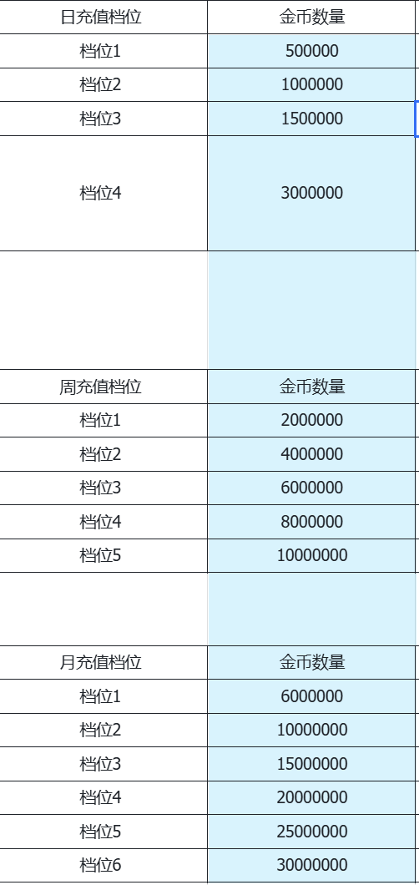

**Daily 12.5m 档位奖励弹窗：**


**Daily 25m 档位奖励弹窗：**

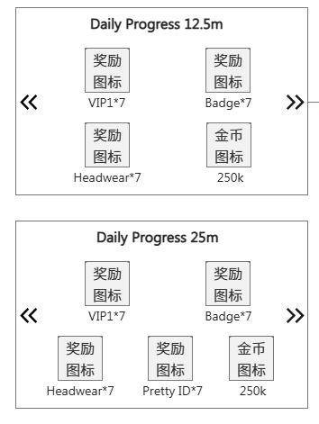

**Weekly 125m 档位奖励弹窗：**

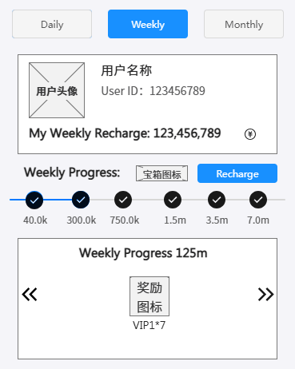

**Monthly 300m 档位奖励弹窗：**

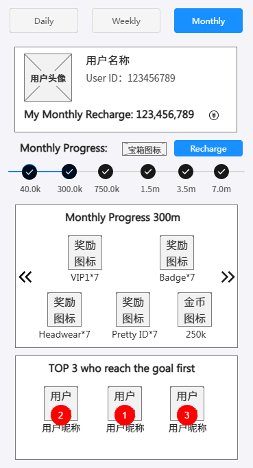

#### 前置条件

- 活动已配置 Daily / Weekly / Monthly 档位。
- 每个档位必须配置门槛、奖励项、发放方式、是否需要客服核销。
- 同一周期内档位门槛必须单调递增，不允许重复门槛。

#### 触发方式

- 充值金币到账事件触发档位达成判断。
- 用户进入活动页触发档位展示。
- 运营后台修改配置后，仅对未结算、未达成的新判断生效；已生成奖励记录不自动重算。

#### 字段与数据来源

| 字段 | 说明 | 统计方式 | 数据来源 |
|---|---|---|---|
| `tier_id` | 档位 ID | 当前活动配置 | 档位配置表 |
| `period_type` | Daily / Weekly / Monthly | 当前周期类型 | 档位配置表 |
| `threshold_amount` | 达档门槛 | 当前周期累计有效充值金币 | 档位配置表 |
| `reward_type` | 奖励类型 | 当前档位 | 奖励配置表 |
| `reward_quantity` | 奖励数量/时长 | 当前档位 | 奖励配置表 |
| `grant_mode` | 自动发放/人工领取 | 当前档位 | 奖励配置表 |
| `manual_deadline` | 人工领取截止时间 | 活动配置 | 活动配置表 |

#### 服务端核心逻辑

- 档位判断只接受充值到账事件驱动，不接受前端上报金额。
- 当"我的累计充值 >= 达档门槛"时生成档位达成记录。
- 同一 活动ID + 用户ID + 周期类型 + 周期ID + 分区 + 档位ID 必须幂等。
- 用户一次充值跨多个档位时，按门槛升序逐档写入达成记录和奖励记录。
- 自动奖励失败必须进入补偿队列；人工权益必须生成待核销记录。

#### 状态设计

| 状态 | 进入条件 | 表现 |
|---|---|---|
| 未达成 | 未达到门槛 | 展示未达成 |
| 已达成 | 已达到门槛但奖励未处理 | 展示达成中 |
| 已自动发放 | 自动奖励成功 | 展示已发放 |
| 待客服领取 | 需客服领取 | 展示联系客服领取 |
| 已核销 | 客服已核销 | 展示已领取 |
| 已过期 | 超过领取截止时间 | 展示已过期 |
| 发放失败 | 发放失败 | 展示处理中，后台补偿 |

#### 边界条件 / 异常处理

| 场景 | 规则 |
|---|---|
| 配置缺奖励项 | 不生成奖励，记录配置异常 |
| 充值撤销/退款 | 若已发奖励，进入风控审核；不直接扣回用户资产，避免资产负数 |
| 活动结束后补到账 | 若到账时间在活动期内，允许补算；否则不计入 |
| 人工权益过期 | 状态改为 `EXPIRED`，客服不可核销 |

#### 权限控制

- 用户只能查看自己的档位达成与奖励状态。
- 客服只能核销人工权益，不允许修改充值累计。
- 运营只能配置未来或未结算周期，不允许直接改用户达成记录。

### 9.1 档位配置字段

| 字段 | 类型 | 说明 |
|---|---|---|
| 档位ID（tier_id） | string | 档位 ID |
| 周期类型（period_type） | enum | Daily / Weekly / Monthly |
| 活动分区（region） | enum/null | 分区；为空表示全区共用 |
| 达档金币门槛（threshold_coin） | integer | 达档金币门槛 |
| 美金展示值（threshold_usd_display） | number | 美金展示值，仅前端展示 |
| 档位名称（tier_name） | string | 档位名称 |
| 排序号（sort_no） | integer | 档位排序 |
| 活动状态（status） | enum | enabled / disabled |

### 9.2 奖励项配置字段

| 字段 | 类型 | 说明 |
|---|---|---|
| 奖励项ID（reward_item_id） | string | 奖励项 ID |
| 档位ID（tier_id） | string | 所属档位 |
| 奖励类型（reward_type） | enum | VIP / frame / effect / bubble / card / coin / badge / pretty_id / banner / boot_screen / room_number |
| 资产系统ID（asset_id） | string | 资产系统 ID |
| 奖励名称（reward_name） | string | 展示名称 |
| 数量（amount） | integer | 数量 |
| 有效期天数（valid_days） | integer/null | 有效期天数 |
| 发放方式（grant_method） | enum | auto / service / operation |
| 叠加规则（stack_rule） | enum | extend / override / coexist / manual |
| 撤销规则（revoke_rule） | enum | auto_revoke / freeze / manual_review / not_revoke |
| 展示图标（display_icon） | string | 展示图标资源 |

### 9.3 档位达成规则

同一用户在同一 周期类型 + 周期ID + 分区 + 档位ID 下，档位奖励最多发放一次。

当一次有效金币到账导致用户累计充值同时跨过多个未达成档位时，系统按档位从低到高依次处理所有新达成档位。

### 9.4 跨档示例

| 用户行为 | 原累计 | 新到账 | 新累计 | 应处理档位 |
|---|---:|---:|---:|---|
| 单笔小额 | 0 | 500,000 | 500,000 | 50 美金档 |
| 单笔跨两档 | 0 | 1,000,000 | 1,000,000 | 50 + 100 美金档 |
| 已领低档后再充值 | 500,000 | 500,000 | 1,000,000 | 只处理 100 美金档 |
| 单笔冲到最高档 | 0 | 30,000,000 | 30,000,000 | 所有新达成档位 |

### 9.5 叠加规则与 Daily 重复领取规则

#### 9.5.1 叠加（同一笔充值计入多周期）

本 PRD 默认建议：允许叠加。

```text
同一笔有效金币到账会同时计入 Daily、Weekly、Monthly 三个统计周期。
若该笔到账使用户分别达到日、周、月档位门槛，则对应周期的档位奖励均可获得。
```

如果运营预算不允许叠加，需改为互斥，并在 Rule 页面显著说明优先级，例如 Monthly > Weekly > Daily。

#### 9.5.2 Daily 重复领取（每日周期重置后档位奖励是否重新发放）

**核心机制：** Daily 周期每日 00:00:00（UTC+3）重置，产生新的周期ID（如 2026-05-09）。新周期ID 导致幂等键中的周期ID字段改变，因此同一档位在新日周期内可重新达成并重新发奖。

**成本影响：**

| 场景 | Daily 发放次数 | 成本 |
|---|---:|---|
| 每天充值 3000 万，持续 30 天 | 30天 × 4档 = **120次** | 高 |
| 每天充值 3000 万，持续 7 天 | 7天 × 4档 = **28次** | 中 |
| 活动期只充 1 天 | 1天 × 4档 = **4次** | 低 |

**对比：** Weekly 周期内幂等键周期ID不变→同档位只发 1 次；Monthly 同理。Daily 是唯一因周期ID每日变化而可能重复领取的周期类型。

**本 PRD 默认建议：** Daily 档位奖励允许每日重复领取（即每个新日周期重新计算、重新达档、重新发奖）。若运营预算不允许，需新增规则限制，例如"整个活动期每个 Daily 档位只发一次"，此时需在幂等键中去掉周期ID或改用活动ID作为周期维度。

**Rule 页面必须说明此规则，避免用户争议。**

#### 9.5.3 综合实例：叠加规则 + Daily 重复领取规则

**场景：** 用户A在 EN 区连续两天充值，每天充值 3000 万金币。档位配置为：Daily 4档、Weekly 5档、Monthly 6档。

| 日期 | 充值事件 | Daily周期ID | Weekly周期ID | Monthly周期ID | Daily发放 | Weekly发放 | Monthly发放 | 当日合计 | 规则解释 |
|---|---|---|---|---|---:|---:|---:|---:|---|
| 周一 | EN区充值3000万金币 | 2026-05-08 | 2026-W19 | 2026-05 | 4 | 5 | 6 | **15** | 同一笔充值同时计入Daily/Weekly/Monthly，三周期档位全部达成，因此日/周/月奖励叠加发放 |
| 周二 | EN区再次充值3000万金币 | 2026-05-09 | 2026-W19 | 2026-05 | 4 | 0 | 0 | **4** | Daily换成新周期ID，可重新达成并重新发放；Weekly/Monthly周期ID不变，周一已发过全部档位，被幂等键拦截 |
| 两天合计 | 合计充值6000万金币 | 2个Daily周期 | 1个Weekly周期 | 1个Monthly周期 | **8** | **5** | **6** | **19** | 叠加发生在每笔充值当下；Daily重复领取发生在跨日新周期 |

**这张表必须这么理解：**

| 概念 | 发生位置 | 判断方式 | 结果 |
|---|---|---|---|
| 叠加规则 | 周一单笔3000万充值 | 同一笔充值同时计入Daily、Weekly、Monthly三个周期 | 周一一次性发 Daily4 + Weekly5 + Monthly6 = 15个奖励 |
| Daily重复领取规则 | 周二再次充值3000万 | Daily周期ID从2026-05-08变为2026-05-09，幂等键不同 | 周二Daily 4档重新发放 |
| Weekly/Monthly不重复 | 周二再次充值3000万 | Weekly周期ID、Monthly周期ID未变化，幂等键已存在 | 周二Weekly/Monthly不再发 |

**幂等键对比：**

| 奖励 | 周一幂等键核心字段 | 周二幂等键核心字段 | 是否冲突 | 是否发放 |
|---|---|---|:---:|:---:|
| Daily 300万档 | 活动ID + 用户A + Daily + 2026-05-08 + EN + tier + Daily300万档 + 奖励项ID | 活动ID + 用户A + Daily + 2026-05-09 + EN + tier + Daily300万档 + 奖励项ID | 否，周期ID不同 | 发放 |
| Weekly 1000万档 | 活动ID + 用户A + Weekly + 2026-W19 + EN + tier + Weekly1000万档 + 奖励项ID | 活动ID + 用户A + Weekly + 2026-W19 + EN + tier + Weekly1000万档 + 奖励项ID | 是，完全相同 | 不发 |
| Monthly 3000万档 | 活动ID + 用户A + Monthly + 2026-05 + EN + tier + Monthly3000万档 + 奖励项ID | 活动ID + 用户A + Monthly + 2026-05 + EN + tier + Monthly3000万档 + 奖励项ID | 是，完全相同 | 不发 |

**一句话结论：**

```text
叠加 = 同一笔充值在同一天同时拿日/周/月奖励。
Daily重复领取 = 第二天新Daily周期重新达档、重新拿Daily奖励。
二者同时存在时，首日奖励最多，后续每日主要持续放大Daily奖励成本。
```

### 9.6 自动奖励与待领取权益

| 奖励类型 | 默认发放方式 | 达标后状态 | 用户通知 |
|---|---|---|---|
| VIP特权(VIP) | 自动发放 | 已到账 | 是 |
| 头像框 | 自动发放 | 已到账 | 是 |
| 进场特效 | 自动发放 | 已到账 | 是 |
| 气泡 | 自动发放 | 已到账 | 是 |
| 资料卡装饰 | 自动发放 | 已到账 | 是 |
| 金币奖励 | 自动发放 | 已到账 | 是 |
| 标签/勋章 | auto 或 operation | 已到账 / 待处理 | 是 |
| 靓号(Pretty ID) | 客服领取 | 待领取 | 是 |
| 靓号 | service / operation | 待领取 | 是 |
| 横幅(Banner) | 运营处理 | 待处理 | 是 |
| 开机屏(开机屏) | 运营处理 | 待处理 | 是 |

### 9.7 发奖幂等规则

每个奖励项发放必须使用幂等键：

```text
幂等键 = 活动ID + 用户ID + 周期类型 + 周期ID + 分区 + 奖励来源 + 档位ID/排名组 + 奖励项ID
```

**幂等键字段说明：**

| 字段 | 说明 | 作用 |
|---|---|---|
| 活动ID（activity_id） | 当前活动唯一标识 | 防止并行活动间幂等失效 |
| 用户ID（user_id） | 金币接收方用户 | 区分不同用户 |
| 周期类型（period_type） | Daily / Weekly / Monthly | 区分周期维度 |
| 周期ID（period_id） | 如 2026-05-08 / 2026-W19 / 2026-05 | Daily 每日不同→可重复领取；Weekly/Monthly 周期内相同→不重复 |
| 分区（region） | EN / AR | 跨区独立累计、独立发奖 |
| 奖励来源（reward_source） | tier / ranking | 区分档位奖励与排行奖励 |
| 档位ID/排名组（tier_id/rank_group） | 档位ID 或 Top1/Top2-3/Top4-8 | 区分同一周期不同档位 |
| 奖励项ID（reward_item_id） | 奖励项唯一标识 | 区分同一档位不同奖励项 |

重复请求、任务重试、页面重复触发不得导致重复发奖。

### 9.8 档位奖励发放流程图（每日0点统一发放）

#### 9.8.1 充值到账与达档判断流程

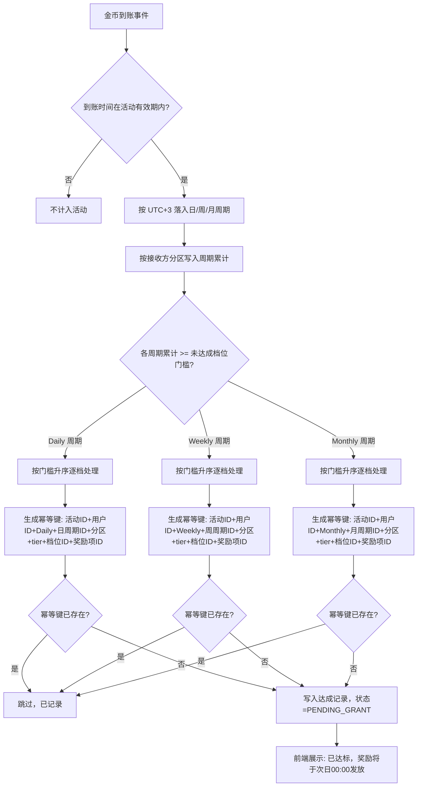
```mermaid
flowchart TD
    A[金币到账事件] --> B{到账时间在活动有效期内?}
    B -->|否| Z1[不计入活动]
    B -->|是| C[按 UTC+3 落入日/周/月周期]
    C --> D[按接收方分区写入周期累计]
    D --> E{各周期累计 >= 未达成档位门槛?}

    E -->|Daily 周期| F1[按门槛升序逐档处理]
    E -->|Weekly 周期| F2[按门槛升序逐档处理]
    E -->|Monthly 周期| F3[按门槛升序逐档处理]

    F1 --> G1[生成幂等键: 活动ID+用户ID+Daily+日周期ID+分区+tier+档位ID+奖励项ID]
    F2 --> G2[生成幂等键: 活动ID+用户ID+Weekly+周周期ID+分区+tier+档位ID+奖励项ID]
    F3 --> G3[生成幂等键: 活动ID+用户ID+Monthly+月周期ID+分区+tier+档位ID+奖励项ID]

    G1 --> H1{幂等键已存在?}
    G2 --> H2{幂等键已存在?}
    G3 --> H3{幂等键已存在?}

    H1 -->|是| Z2[跳过，已记录]
    H1 -->|否| I1[写入达成记录，状态=PENDING_GRANT]
    H2 -->|是| Z2
    H2 -->|否| I1
    H3 -->|是| Z2
    H3 -->|否| I1

    I1 --> J[前端展示: 已达标，奖励将于次日00:00发放]
```

#### 9.8.2 每日0点统一发奖流程

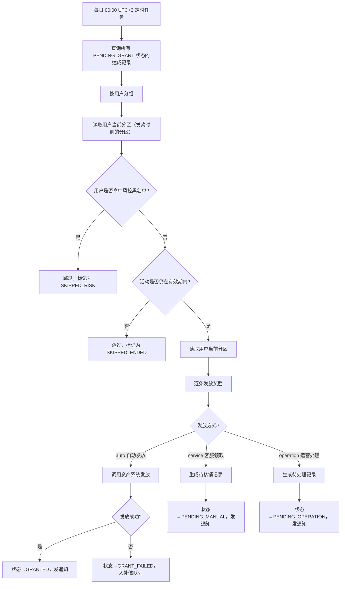
```mermaid
flowchart TD
    A[每日 00:00 UTC+3 定时任务] --> B[查询所有 PENDING_GRANT 状态的达成记录]
    B --> C[按用户分组]
    C --> D[读取用户当前分区（发奖时刻的分区）]
    D --> E{用户是否命中风控黑名单?}
    E -->|是| Z1[跳过，标记为 SKIPPED_RISK]
    E -->|否| F{活动是否仍在有效期内?}
    F -->|否| Z2[跳过，标记为 SKIPPED_ENDED]
    F -->|是| G[读取用户当前分区]
    G --> H[逐条发放奖励]

    H --> I{发放方式?}
    I -->|auto 自动发放| J[调用资产系统发放]
    I -->|service 客服领取| K[生成待核销记录]
    I -->|operation 运营处理| L[生成待处理记录]

    J --> M{发放成功?}
    M -->|是| N[状态→GRANTED，发通知]
    M -->|否| O[状态→GRANT_FAILED，入补偿队列]
    K --> P[状态→PENDING_MANUAL，发通知]
    L --> Q[状态→PENDING_OPERATION，发通知]
```

#### 9.8.3 发奖规则说明

| 周期类型 | 发奖时间 | 发奖范围 |
|---|---|---|
| Daily | 每日 00:00（UTC+3） | 发放昨日达标的 Daily 档位奖励 |
| Weekly | 每日 00:00（UTC+3） | 发放本周新达标的 Weekly 档位奖励（分多天发） |
| Monthly | 每日 00:00（UTC+3） | 发放本月新达标的 Monthly 档位奖励（分多天发） |

**分区取值规则**：发奖时按用户**发奖时刻的分区**判断，而非充值时刻的分区。

**示例**：
- 用户周一充值时分区为 EN，周一达标 Weekly 档位
- 周二 00:00 发奖时用户分区已变更为 AR
- 奖励按 AR 分区发放，记录在 AR 区

### 9.9 Daily 重复领取机制流程图（每日0点发放）

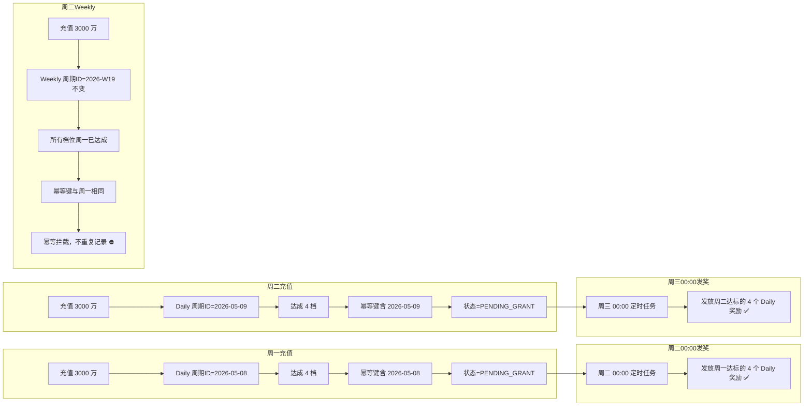
```mermaid
flowchart LR
    subgraph 周一充值
        A1[充值 3000 万] --> B1[Daily 周期ID=2026-05-08]
        B1 --> C1[达成 4 档]
        C1 --> D1[幂等键含 2026-05-08]
        D1 --> E1[状态=PENDING_GRANT]
    end

    subgraph 周二00:00发奖
        E1 --> F1[周二 00:00 定时任务]
        F1 --> G1[发放周一达标的 4 个 Daily 奖励 ✅]
    end

    subgraph 周二充值
        A2[充值 3000 万] --> B2[Daily 周期ID=2026-05-09]
        B2 --> C2[达成 4 档]
        C2 --> D2[幂等键含 2026-05-09]
        D2 --> E2[状态=PENDING_GRANT]
    end

    subgraph 周三00:00发奖
        E2 --> F2[周三 00:00 定时任务]
        F2 --> G2[发放周二达标的 4 个 Daily 奖励 ✅]
    end

    subgraph 周二Weekly
        A3[充值 3000 万] --> B3[Weekly 周期ID=2026-W19 不变]
        B3 --> C3[所有档位周一已达成]
        C3 --> D3[幂等键与周一相同]
        D3 --> E3[幂等拦截，不重复记录 ⛔]
    end
```

**发放汇总**：
- 周二 00:00：发放周一达标的 Daily 4 个 + Weekly 5 个 + Monthly 6 个 = 15 个奖励
- 周三 00:00：发放周二达标的 Daily 4 个（Weekly/Monthly 周一已达标，幂等拦截）

### 9.10 跨区累计与发奖实例

**场景：** 用户 A 在 EN 区和 AR 区都有充值行为。

| 步骤 | 时间 | 事件 | EN 区累计 | AR 区累计 | EN 档位达成 | AR 档位达成 | 奖励发放时间 |
|---|---|---|---|---:|---:|---|---|---|
| 1 | 周一 10:00 | EN 区充值 300 万金币 | 3,000,000 | 0 | 50万/100万/150万/300万 ✅ | 无 | 周二 00:00 发放 EN 区 4 个 Daily 档位奖励 |
| 2 | 周一 15:00 | AR 区充值 100 万金币 | 3,000,000 | 1,000,000 | 同上 | 50万/100万 ✅ | 周二 00:00 发放 AR 区 2 个 Daily 档位奖励 |
| 3 | 周二 09:00 | EN 区充值 50 万金币 | 500,000（新日周期） | 1,000,000（新日周期从 0，周/月继续） | 50万 ✅ | 无 | 周三 00:00 发放 EN 区 1 个新日周期 Daily 奖励 |
| 4 | 周二 11:00 | AR 区充值 200 万金币 | 500,000 | 2,000,000（日累计从 0 重计，周累计=100万+200万=300万） | 同上 | 50万/100万/150万 ✅ | 周三 00:00 发放 AR 区 3 个新日周期 Daily 奖励 |

**关键规则：**

1. **分区独立：** EN 和 AR 各记各的，不合并。用户在 EN 充 300 万不影响 AR 的累计。
2. **分区变更：** 若用户从 EN 变更为 AR，变更后的充值计入 AR，变更前 EN 的累计留在 EN 不迁移。
3. **幂等键含分区：** 同一档位在 EN 和 AR 分别生成不同幂等键，分别发奖，互不干扰。
4. **Daily 重置：** 周二新日周期，EN 和 AR 各自从 0 重新累计，可重新达档、重新发奖。
5. **发奖时刻分区：** 发奖时按用户发奖时刻的分区判断。若用户充值时在 EN 区，发奖时已切换到 AR 区，则奖励按 AR 区发放。

---

## 10. Top3 达标榜


#### 对应原型

**Daily Top3 奖励说明弹窗：**

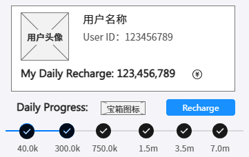

**Weekly Top3 奖励说明弹窗：**

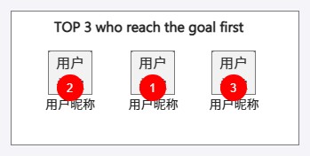

**Monthly Top3 奖励说明弹窗：**

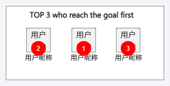

#### 前置条件

- 当前周期存在至少一个档位配置。
- 用户达到某个档位门槛时，服务端可取得该档位当前已达成用户序列。

#### 触发方式

- 每次档位首次达成时触发 Top3 排名写入。
- 页面加载时读取当前周期、当前档位的 Top3 达成记录。

#### 字段与数据来源

| 字段 | 说明 | 统计方式 | 数据来源 |
|---|---|---|---|
| `tier_id` | 档位 ID | 当前选中档位 | 档位配置表 |
| `排名` | 第几个达成 | 按首次达成时间升序 | `tier_achievement` |
| `achieved_at` | 达成时间 | UTC+3 周期内首次达成时间 | 服务端写入 |
| `user_头像` | 用户头像 | 实时用户资料 | 用户服务 |
| `display_name` | 用户昵称 | 实时用户资料 | 用户服务 |
| `reward_desc` | Top3 奖励说明 | 当前档位配置 | 奖励配置表 |

#### 服务端核心逻辑

- Top3 不是充值金额排名，而是“当前档位最先达成前三名”。
- 排序字段为 `achieved_at ASC`，同毫秒并发时使用 `achievement_id ASC` 二级排序。
- 同一用户同一档位只占一个 Top3 名额。
- 达到更高档位时可参与更高档位 Top3，但不重复占用同一档位。

#### 状态设计

| 状态 | 进入条件 | 表现 |
|---|---|---|
| 空 | 暂无用户达成 | 展示空位或占位文案 |
| 部分达成 | 已有 1-2 人达成 | 展示已达成人员和剩余空位 |
| 已满 | 已有 3 人达成 | 固定展示前三名 |

#### 边界条件 / 异常处理

- 用户改昵称头像：Top3 展示可实时读取最新资料，但达成时间和排名不得改变。
- 用户被封禁：前端可隐藏该用户展示，但奖励记录保留，需后台风控处理。
- 并发达成：服务端事务内排序写入，不能前端抢占。

#### 权限控制

- 所有可参与活动用户可查看 Top3。
- 风控用户不参与 Top3 写入。

### 10.1 定义

Top3 达标榜不是充值金额总榜。

它表示：在当前统计周期、当前分区、当前查看档位下，最先达到该档位门槛的前三名用户。

维度：

```text
period_type + period_id + region + tier_id
```

### 10.2 生成流程

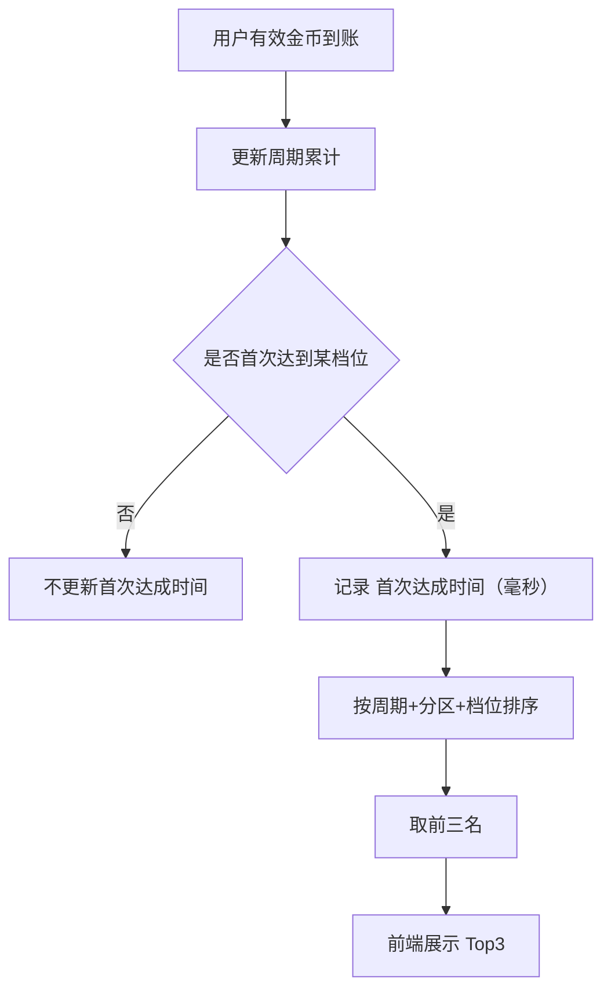
```mermaid
flowchart TD
    A[用户有效金币到账] --> B[更新周期累计]
    B --> C{是否首次达到某档位}
    C -->|否| D[不更新首次达成时间]
    C -->|是| E[记录 首次达成时间（毫秒）]
    E --> F[按周期+分区+档位排序]
    F --> G[取前三名]
    G --> H[前端展示 Top3]
```

### 10.3 排序规则

| 优先级 | 字段 | 方向 | 说明 |
|---:|---|---|---|
| 1 | 首次达成时间（毫秒） | 升序 | 越早达成越靠前 |
| 2 | 财富等级 | 降序 | 同时间按财富等级 |
| 3 | 达成时累计金币（reach_amount_coin） | 降序 | 同等级按达成时累计金币 |
| 4 | 用户ID（user_id） | 升序 | 最终兜底，保证稳定 |

### 10.4 空状态

| 达成人数 | 展示规则 |
|---:|---|
| 0 | Top3 区域展示空状态 |
| 1 | 展示 1 名用户，其余 2 个占位 |
| 2 | 展示 2 名用户，其余 1 个占位 |
| ≥3 | 展示前三名 |

---

## 11. Recharge Ranking 排行榜页


### 11.0 模块基础信息（按 skill 模板补齐）

#### 模块背景

Recharge Ranking 用于展示 Weekly / Monthly 充值榜单，承担冲榜刺激、奖励预期展示和周期结束后快照沉淀的职责。

#### 对应原型

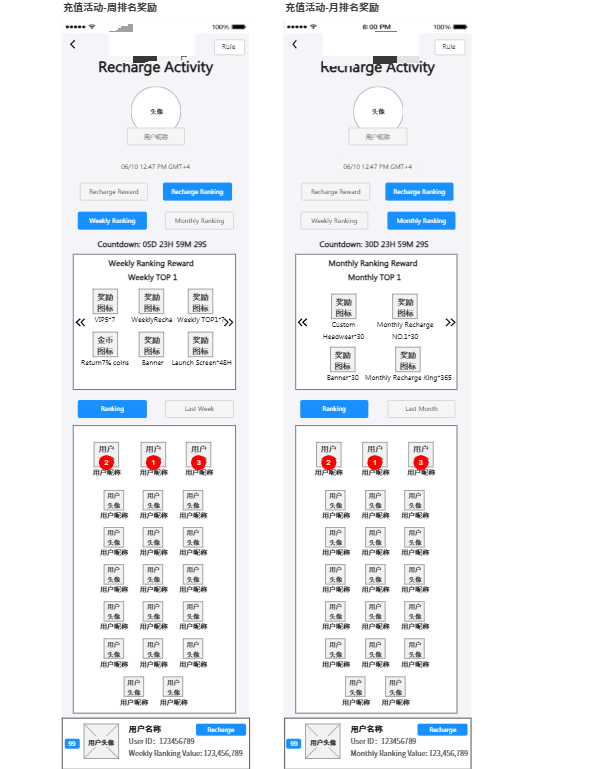

#### 前置条件

- 活动状态为 Online 或展示期内。
- 用户所属分区已确定。
- 当前周期 Weekly / Monthly 榜单已初始化。

#### 触发方式

| 触发点 | 行为 |
|---|---|
| 点击 Recharge Ranking | 进入榜单页 |
| 点击 Weekly / Monthly | 切换榜单周期 |
| 倒计时结束 | 冻结榜单并进入发奖流程 |
| 点击历史入口 | 进入历史榜单页 |

#### 字段与数据来源

| 字段 | 说明 | 统计方式 | 数据来源 |
|---|---|---|---|
| `ranking_type` | Weekly / Monthly | 当前榜单类型 | 前端 Tab 状态 |
| `排名` | 排名 | 当前周期按累计充值倒序 | `recharge_period_summary` |
| `user_id` | 上榜用户 | 当前分区 | 用户服务 |
| `recharge_amount` | 榜单累计充值 | 当前 Weekly/Monthly 周期累计有效金币到账 | 周期汇总表 |
| `reward_preview` | 排名奖励预览 | 当前榜单配置 | 奖励配置表 |
| `my_排名` | 我的排名 | 当前周期实时排名 | 榜单查询服务 |
| `countdown` | 距周期结束剩余时间 | UTC+3 周期结束时间 - 当前服务端时间 | 服务端时间 |

口径说明：榜单页与 Reward 页共用有效充值口径，但榜单仅支持 Weekly / Monthly，不展示 Daily 榜单。

#### 服务端核心逻辑

- 榜单实时查询可使用汇总表排序，但发奖必须依赖周期结束快照。
- 榜单仅展示当前用户分区内用户，不能跨 EN / AR 混排。
- 周期结束时冻结 Top20 及我的排名快照，历史榜单读取快照，不读实时汇总。
- 排名相同金额时按达到该累计金额的时间升序；仍相同按 `user_id ASC` 稳定排序。

#### 状态设计

| 状态 | 进入条件 | 表现 |
|---|---|---|
| `RANKING_RUNNING` | 周期未结束 | 展示实时榜单和倒计时 |
| `RANKING_FREEZING` | 周期刚结束正在冻结 | 暂停刷新，提示结算中 |
| `RANKING_SETTLED` | 快照和奖励完成 | 当前周期转入历史 |
| `NO_RANK` | 用户未进入榜单 | 我的排名条展示未上榜 |

#### 边界条件 / 异常处理

- 榜单刷新延迟：页面展示“数据有短暂延迟”，不得承诺秒级准确。
- 用户在周期结束瞬间充值：以金币到账时间判断是否计入。
- 榜单快照失败：不得发奖，进入后台告警和重试。

#### 权限控制

- 普通用户只能查看本分区榜单。
- 风控用户不进入榜单排名。
- 运营可在后台查看全分区榜单与快照。

### 11.1 页面结构

| 区域 | 内容 |
|---|---|
| 一级 Tab | Recharge Ranking 选中 |
| 二级 Tab | Weekly Ranking / Monthly Ranking，默认 Weekly |
| 倒计时 | Countdown: `{dd}D {hh}H {mm}M {ss}S` |
| 排行奖励区 | Weekly / Monthly Ranking Reward |
| 榜单列表 | Top20 用户 |
| 我的排名条 | 固定置底 |

### 11.2 榜单类型

| 类型 | 统计周期 | 展示范围 | 是否有排行奖励 |
|---|---|---|---:|
| Weekly Ranking | 当前 UTC+3 周 | 当前分区 Top20 | 是 |
| Monthly Ranking | 当前 UTC+3 月 | 当前分区 Top20 | 是 |

Daily 不进入 Ranking 页，只参与 Recharge Reward 页档位奖励与 Top3 达标展示。

### 11.3 周/月榜排序规则

周/月榜按用户在当前周期、当前分区内的有效累计金币数降序排名。

| 优先级 | 字段 | 方向 |
|---:|---|---|
| 1 | 周期累计金币 | 降序 |
| 2 | 达成当前金额时间 | 升序 |
| 3 | 财富等级 | 降序 |
| 4 | 用户ID（user_id） | 升序 |

### 11.4 榜单列表字段

| 字段 | 说明 | 本 PRD 规则 |
|---|---|---|
| 排名 | 排名 | 必须展示 |
| 头像 | 用户头像 | 展示头像 |
| 昵称 | 昵称 | 展示昵称 |
| 累计金币（total_coin） | 当前周期累计有效金币 | 榜单行建议展示 |
| 活动分区（region） | 分区 | 接口字段必须有 |
| 是否本人 | 是否本人 | 用于高亮本人 |

### 11.5 我的排名条

| 字段 | 规则 |
|---|---|
| 我的排名 | 上榜展示实际名次；未上榜显示 20+ |
| 我的累计充值值 | 当前周期、当前分区累计有效金币 |
| Recharge 按钮 | 点击跳转充值页 |

### 11.6 倒计时结束规则

倒计时结束后：

1. 前端切换到新周期展示。
2. 后端冻结上一周期榜单快照。
3. 不得删除、覆盖上一周期数据。
4. 历史榜单、排行奖励、客服对账均读取快照。

---

## 12. 排行奖励规则

### 12.1 奖励范围

| 榜单 | 奖励分组 | 说明 |
|---|---|---|
| Weekly Ranking | Top1 | 周榜第 1 名 |
| Weekly Ranking | Top2-3 | 周榜第 2-3 名 |
| Weekly Ranking | Top4-8 | 周榜第 4-8 名 |
| Monthly Ranking | Top1 | 月榜第 1 名 |
| Monthly Ranking | Top2-3 | 月榜第 2-3 名 |
| Monthly Ranking | Top4-8 | 月榜第 4-8 名 |

### 12.2 发奖时间

排行奖励在统计周期结束后，次日 01:00（UTC+3）自动发放。

| 榜单 | 周期结束 | 发奖时间 |
|---|---|---|
| 周榜 | 下周一 00:00:00 | 周一 01:00:00 |
| 月榜 | 次月 1 日 00:00:00 | 次月 1 日 01:00:00 |

### 12.3 发放流程

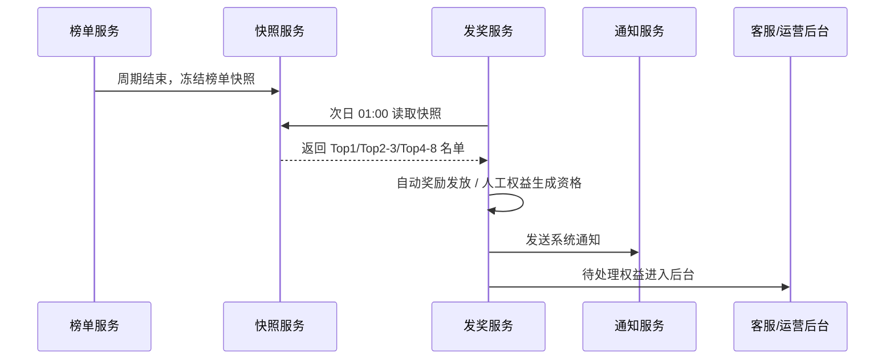
```mermaid
sequenceDiagram
    participant Rank as 榜单服务
    participant Snapshot as 快照服务
    participant Reward as 发奖服务
    participant Notify as 通知服务
    participant Ops as 客服/运营后台

    Rank->>Snapshot: 周期结束，冻结榜单快照
    Reward->>Snapshot: 次日 01:00 读取快照
    Snapshot-->>Reward: 返回 Top1/Top2-3/Top4-8 名单
    Reward->>Reward: 自动奖励发放 / 人工权益生成资格
    Reward->>Notify: 发送系统通知
    Reward->>Ops: 待处理权益进入后台
```

### 12.4 快照字段

| 字段 | 说明 |
|---|---|
| 快照ID | 快照 ID |
| 排名类型 | Weekly / Monthly |
| period_id | 周期 ID |
| 活动分区（region） | 分区 |
| frozen_at | 冻结时间 |
| 排名 | 排名 |
| 用户ID（user_id） | 用户 ID |
| 昵称_snapshot | 昵称快照 |
| 头像_snapshot | 头像快照 |
| 累计金币（total_coin） | 累计有效金币 |
| reward_group | Top1 / Top2-3 / Top4-8 / none |
| reward_status | pending / granting / success / partial_success / failed / revoked |

---

## 13. 历史榜单页


### 13.0 模块基础信息（按 skill 模板补齐）

#### 模块背景

历史榜单用于展示已冻结、已结算的 Weekly / Monthly 榜单记录，解决用户追溯奖励依据和客服解释口径问题。

#### 对应原型

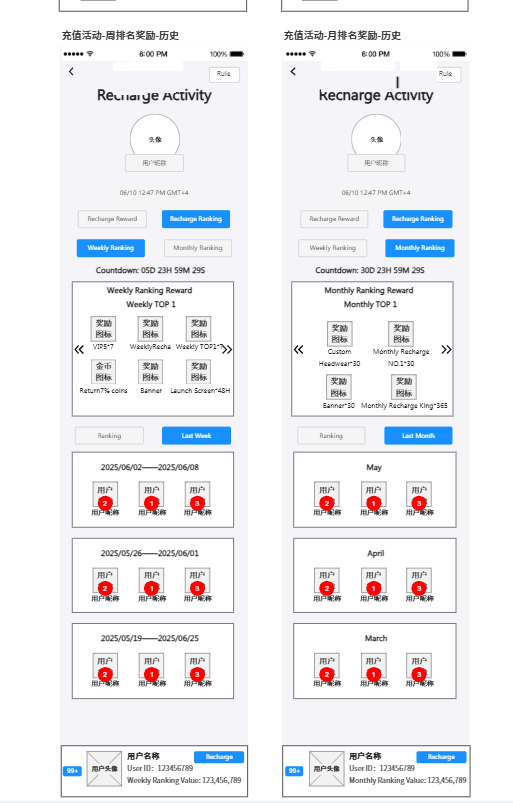

#### 前置条件

- 至少存在一个已冻结榜单快照。
- 用户所属分区可识别。
- 历史展示范围已按配置确定。

#### 触发方式

- 用户从 Ranking 页点击历史入口。
- 用户切换 Weekly / Monthly 历史类型。

#### 字段与数据来源

| 字段 | 说明 | 统计方式 | 数据来源 |
|---|---|---|---|
| `快照ID` | 快照 ID | 已结算周期 | `ranking_snapshot` |
| `period_key` | 周期标识 | UTC+3 周/月份 | 快照表 |
| `排名` | 历史排名 | 快照排名，不重算 | 快照明细 |
| `recharge_amount` | 历史累计充值 | 快照金额，不重算 | 快照明细 |
| `reward_status` | 奖励发放状态 | 快照对应奖励记录 | `reward_grant` |

#### 服务端核心逻辑

- 历史榜单只读取快照，不读取实时汇总。
- 展示近 3 周 / 近 3 月时，按快照周期结束时间倒序取数。
- 若历史快照缺失，不允许用实时表补造历史。

#### 状态设计

| 状态 | 进入条件 | 表现 |
|---|---|---|
| 有历史 | 有快照 | 展示历史列表 |
| 无历史 | 无快照 | 展示空状态 |
| 快照异常 | 快照缺字段 | 隐藏异常记录并上报告警 |

#### 异常处理 / 权限控制

- 用户只能查看本分区历史榜单。
- 快照数据异常时后台告警，前端展示空状态或部分可用数据，不允许展示混乱排序。

### 13.1 页面结构

| 切换标签 | 展示范围 | 每条内容 |
|---|---|---|
| 周历史 | 近 3 周 | 周期日期范围 + Top3，支持展开 Top8 |
| 月历史 | 近 3 月 | 月份 + Top3，支持展开 Top8 |

### 13.2 历史展示规则

| 场景 | 展示规则 |
|---|---|
| 有快照 | 展示快照数据 |
| 无快照 | 展示空状态 |
| 奖励覆盖 Top4-8 | 页面支持展开 Top8 或展示本人历史排名 |
| 用户本人当期有排名 | 展示本人排名、累计充值、奖励状态 |
| 用户当前分区变更 | 历史仍按当期快照分区展示 |

### 13.3 不可追溯原则

历史榜单展示以周期结束时快照为准。

后续用户昵称、头像、财富等级变化，不影响已冻结快照中的历史排名与发奖依据。

若出现退款、刷榜、风控处理，系统追加异常标记，不直接物理删除原快照。

---

## 14. Rule 规则页


### 14.0 模块基础信息（按 skill 模板补齐）

#### 模块背景

Rule 页用于把活动时间、统计口径、奖励领取、分区规则、异常说明统一解释给用户，降低客服问询和活动争议。

#### 对应原型

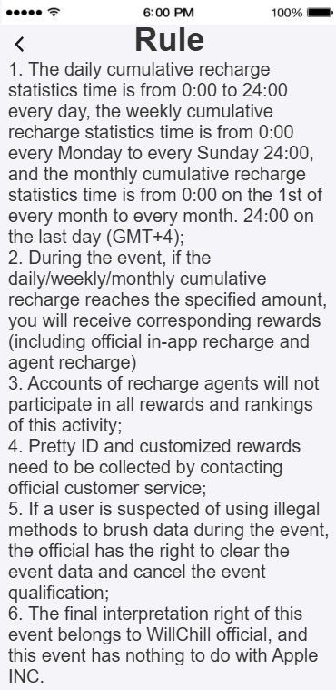

#### 前置条件

- 活动规则文案已配置并通过运营审核。
- Rule 页展示口径必须与服务端实际计算规则一致。

#### 触发方式

- 用户点击活动页右上角 Rule。
- 用户从活动入口进入后查看规则说明。

#### 字段与数据来源

| 字段 | 说明 | 统计方式 | 数据来源 |
|---|---|---|---|
| `activity_time_text` | 活动时间说明 | UTC+3 活动有效期 | 活动配置 |
| `recharge_scope_text` | 有效充值说明 | 有效金币到账口径 | 规则配置 |
| `reward_claim_text` | 奖励领取说明 | 自动发放/人工领取规则 | 奖励配置 |
| `region_text` | 分区说明 | 用户活动分区 | 分区规则配置 |

#### 交互逻辑

- Rule 页从当前活动页打开，返回后保留用户原周期 Tab。
- Rule 内容不允许写死在客户端，必须支持后台配置或服务端下发。
- 若规则接口失败，展示兜底规则文案版本号和重试按钮。

#### 服务端核心逻辑

- 规则文案需要带版本号 `rule_version`。
- 活动配置变更时，Rule 文案版本必须同步更新。
- 客服后台查询用户争议时，应能看到用户参与时对应的规则版本。

#### 异常处理 / 权限控制

| 类型 | 规则 |
|---|---|
| 异常处理 | Rule 获取失败时展示重试，不展示空白页 |
| 权限控制 | 所有用户可查看 Rule，未登录也可查看公开规则 |

### 14.1 页面内容

Rule 页面需要明确展示：

1. 活动统计时间。
2. 充值统计口径。
3. 水晶/币商/代理账号计入规则。
4. 档位奖励发放方式。
5. 排行奖励发放时间。
6. 定制奖励领取方式。
7. 风控与资格取消规则。
8. 最终解释权。

### 14.2 推荐文案

```text
1. 活动所有统计时间均以 UTC+3 为准。<strong>【产品已确认】</strong>原型Rule页需修正为UTC+3。
2. Daily 统计周期为每日 00:00:00 至次日 00:00:00；Weekly 统计周期为周一 00:00:00 至下周一 00:00:00；Monthly 统计周期为每月 1 日 00:00:00 至次月 1 日 00:00:00。
3. 活动累计充值以有效金币到账为准，包括官方应用内充值到账金币、第三方充值链接充值到账金币、普通用户通过币商购买后到账的金币、通过他人/自己预支或借支充值到账的金币、提现转为金币、钻石兑换金币、币商给自己充值后到账的金币，以及运营后台选择“线下充值”类型并加币成功的金币。
4. 单纯水晶侧变动、内部调账、未形成金币到账的记录不计入；一旦形成有效金币到账事件，则按金币接收方计入活动累计。
<span style="color:red"><strong>特别说明：除上述明确指定计入充值活动的金币来源外，其他金币来源均不计入充值活动，例如幸运礼物返币、金币红包、活动奖励金币等。</strong></span>
5. Daily / Weekly / Monthly 档位奖励在用户达到门槛后自动处理。自动奖励将直接发放到账户，Pretty ID、靓号等定制权益需联系客服领取。
6. Weekly / Monthly 排行奖励将在周期结束后的次日 01:00（UTC+3）基于周期榜单快照发放。
7. 如发现退款、刷榜、异常交易、违规数据行为，官方有权取消活动资格、追回奖励或清空活动数据。
8. 本活动最终解释权归官方所有。
```

---

## 15. 奖励发放状态机

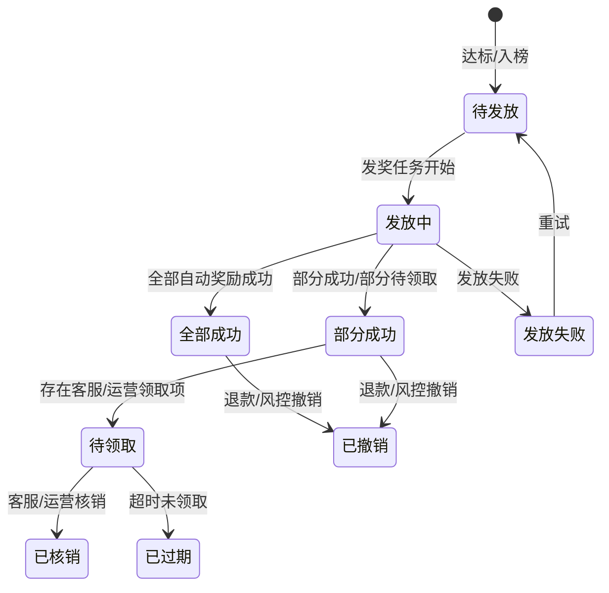
```mermaid
stateDiagram-v2
    [*] --> 待发放: 达标/入榜
    待发放 --> 发放中: 发奖任务开始
    发放中 --> 全部成功: 全部自动奖励成功
    发放中 --> 部分成功: 部分成功/部分待领取
    发放中 --> 发放失败: 发放失败
    部分成功 --> 待领取: 存在客服/运营领取项
    待领取 --> 已核销: 客服/运营核销
    待领取 --> 已过期: 超时未领取
    全部成功 --> 已撤销: 退款/风控撤销
    部分成功 --> 已撤销: 退款/风控撤销
    发放失败 --> 待发放: 重试
```

### 15.1 状态定义

| 状态 | 含义 | 用户可见 | 通知规则 |
|---|---|---:|---|
| 待发放 | 已获得资格，待发放 | 可选 | 一般不通知 |
| 发放中 | 发放中 | 否 | 不通知 |
| 全部成功 | 全部自动奖励成功 | 是 | 通知奖励到账 |
| 部分成功 | 部分成功，部分待领取 | 是 | 通知已到账 + 联系客服 |
| 待领取 | 待客服/运营核销 | 是 | 通知领取方式 |
| 已核销 | 已人工核销 | 是 | 通知领取成功 |
| 发放失败 | 发放失败 | 否 | 后台告警，不建议直接通知用户 |
| 已过期 | 领取过期 | 是 | 通知资格过期 |
| 已撤销 | 奖励撤销 | 视风控 | 视情况通知 |

---

## 16. 通知规则

| 场景 | 是否通知 | 通知内容 |
|---|---:|---|
| 档位自动奖励到账 | 是 | 恭喜获得 XX 奖励，已到账 |
| 档位存在待领取权益 | 是 | 自动奖励已到账，定制权益请联系客服领取 |
| 周/月排行奖励到账 | 是 | 恭喜获得 Weekly/Monthly Ranking 奖励 |
| 排行奖励存在运营处理项 | 是 | 获得榜单权益，请联系客服/等待运营处理 |
| 奖励发放失败 | 否 | 后台告警，用户侧不直接暴露 |
| 奖励资格过期 | 是 | 您的 XX 权益已过期 |
| 风控取消资格 | 视情况 | 按运营风控策略通知 |

---

## 17. 页面刷新策略

| 数据 | 刷新策略 | 说明 |
|---|---|---|
| 我的累计充值 | 页面进入、充值返回、手动刷新、到账事件后刷新 | 用户最敏感 |
| 进度条 | 跟随我的累计充值即时刷新 | 防止达标不显示 |
| 档位达成状态 | 发奖状态变化后刷新 | 防止重复领取误解 |
| Top3 达标榜 | 分钟级刷新或事件驱动刷新 | 保持竞争感 |
| 周/月 Top20 榜单 | 每小时自动刷新 | 与原文一致，降低压力 |
| 倒计时 | 前端秒级倒计时 + 服务端校时 | 防止本地时间漂移 |
| 历史榜单 | 快照生成后刷新 | 稳定展示 |

注意：原文“榜单每小时刷新一次”仅适用于 Top20 列表，不适用于我的累计充值、进度条和奖励状态。

---

## 18. 后台与运营能力要求

本 PRD 不展开完整后台 UI，但必须提供以下能力，否则活动上线后无法运营和对账。

### 18.1 活动配置


#### 对应配置表原型

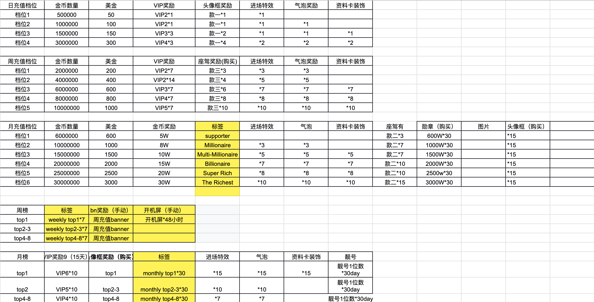

#### 后台字段与数据来源（按 skill 模板补齐）

**筛选区字段：**

| 字段 | 说明 | 统计方式 | 数据来源 |
|---|---|---|---|
| `activity_id` | 活动 ID | 当前配置 | 活动配置表 |
| `period_type` | Daily / Weekly / Monthly | 当前筛选 | 后台筛选条件 |
| `region` | EN / AR | 当前筛选 | 后台筛选条件 |
| `reward_status` | 奖励状态 | 当前筛选 | `reward_grant` |
| `user_keyword` | 用户搜索 | 昵称/ID 精确或模糊匹配 | 用户服务 |

**列表/详情字段：**

| 字段 | 说明 | 统计方式 | 数据来源 |
|---|---|---|---|
| `user_id` | 用户 ID | 单用户 | 用户服务 |
| `period_key` | 周期 | UTC+3 周期 | 周期服务 |
| `recharge_amount` | 周期累计充值 | 周期内有效金币到账累计 | `recharge_period_summary` |
| `tier_id` | 达成档位 | 周期内达成记录 | `tier_achievement` |
| `reward_items` | 奖励明细 | 达成档位配置快照 | `reward_grant` |
| `grant_status` | 发放状态 | 实时状态 | `reward_grant` |
| `operator_id` | 核销人 | 人工核销时写入 | 后台账号 |
| `operated_at` | 操作时间 | 核销/补偿时间 | 后台操作日志 |

#### 后台服务端核心逻辑

- 后台配置保存时必须校验周期、分区、档位门槛、奖励项完整性。
- 活动上线后，已结算周期配置不可修改；未结算周期若修改，必须生成配置版本。
- 客服核销人工奖励时必须校验：用户、活动、周期、档位、奖励状态、领取截止时间。
- 所有后台操作写审计日志，支持按用户和活动追溯。

#### 权限控制

| 角色 | 权限 |
|---|---|
| 运营 | 创建/编辑活动配置、查看统计 |
| 客服 | 查看用户奖励状态、核销人工权益 |
| 财务/风控 | 查看异常记录、处理补偿/冻结 |
| 普通用户 | 无后台权限 |

### 18.2 客服/运营核销

| 能力 | 说明 |
|---|---|
| 待领取权益列表 | Pretty ID、靓号等待处理权益 |
| 用户资格查询 | 按用户 ID 查活动达标和榜单记录 |
| 快照查询 | 查周/月榜历史快照 |
| 人工核销 | 标记待领取权益为已处理 |
| 失败重试 | 对发奖失败记录重试 |
| 风控撤销 | 撤销违规用户奖励资格 |

### 18.3 资产赠送（后台平台管理）

#### 对应原型

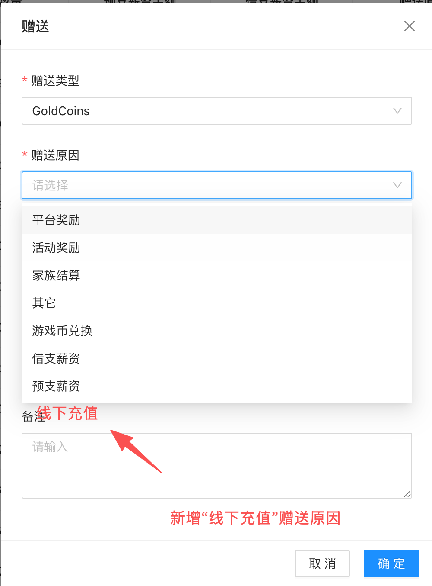

#### 模块说明

后台平台管理中的"资产赠送"功能，用于运营/客服向用户账户发放金币或其他虚拟资产。该功能与充值活动的关联在于：**只有赠送原因选择"线下充值"且赠送类型为 GoldCoins（金币）时，该笔金币到账才计入充值活动累计**（参见 6.2 计入规则表）。

#### 弹窗字段

| 字段 | 类型 | 必填 | 说明 |
|---|---|---:|---|
| 赠送类型（gift_type） | 下拉选择 | 是 | 资产类型，如 GoldCoins（金币）等 |
| 赠送原因（gift_reason） | 下拉选择 | 是 | 赠送原因，决定是否计入充值活动（见下方枚举） |
| 备注（remark） | 多行文本 | 否 | 运营/客服填写的备注说明 |

#### 赠送原因枚举与充值活动计入规则

| 枚举值 | 赠送原因 | 是否计入充值活动 | 说明 |
|---|---|---:|---|
| offline_recharge | 线下充值 | **是** | 用户通过线下渠道充值，运营后台确认收款后加币，该笔金币到账计入充值活动累计 |
| platform_reward | 平台奖励 | 否 | 平台主动奖励，不计入 |
| activity_reward | 活动奖励 | 否 | 活动奖励金币，不计入 |
| family_settlement | 家族结算 | 否 | 家族分成/结算，不计入 |
| game_currency_exchange | 游戏币兑换 | 否 | 游戏币兑换金币，不计入（游戏币兑换与钻石兑换是不同口径，钻石兑换走独立 source_type） |
|                        |            |                  |                                                              |
|                        |            |                  |                                                              |
| other | 其它 | 否 | 其他原因，不计入 |

#### 服务端核心逻辑

- 赠送类型为 GoldCoins 且赠送原因为"线下充值"时，金币到账事件必须写入 `recharge_event` 表，source_type 标记为 `offline_recharge`，is_valid = true。
- 赠送类型为 GoldCoins 但赠送原因不为"线下充值"时，金币到账事件不写入 `recharge_event` 表（或写入但 is_valid = false，source_type 标记为 `operation`），不计入充值活动累计。
- 赠送类型非 GoldCoins（如钻石、游戏币等）时，与充值活动无关，按原有资产系统逻辑处理。
- 所有赠送操作必须写审计日志，包含操作人、目标用户、赠送类型、赠送原因、金额、备注、操作时间。
- <span style="color:red"><strong>【红线】赠送原因枚举中，只有"线下充值"计入充值活动。其他赠送原因（平台奖励、活动奖励、家族结算、游戏币兑换、借支薪资、预支薪资、其它）产生的金币到账一律不计入充值活动累计。</strong></span>

#### 权限控制

| 角色 | 是否可操作 | 限制 |
|---|---:|---|
| 运营 | 是 | 可选择所有赠送原因，包括"线下充值" |
| 客服 | 是 | 默认不可选择"线下充值"原因，需额外权限审批；其他赠送原因可操作 |
| 财务/风控 | 是 | 可选择所有赠送原因 |
| 普通用户 | 否 | 无后台权限 |

#### 边界条件

| 场景 | 处理规则 |
|---|---|
| 线下充值赠送后用户退款 | 按退款流程处理，扣减活动累计或进入风控审核（参见 6.4） |
| 线下充值赠送金额填写错误 | 运营后台需有撤销/修正能力，撤销后扣减活动累计 |
| 赠送操作中途失败 | 金币未到账则不计入活动，后台显示失败状态，支持重试 |
| 同一用户同一天多次线下充值赠送 | 每次独立生成 recharge_event，各自计入活动累计 |

---

### 18.4 资产扣除——充值活动扣除（后台平台管理）

#### 对应原型

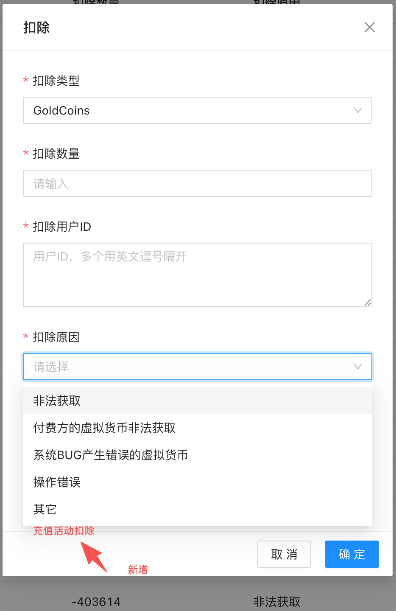

#### 模块说明

后台平台管理中的"资产扣除"功能，新增扣除原因"充值活动扣除"。当运营/风控通过该类型扣除用户金币时，系统必须同步扣减该用户在充值达标活动中的充值金币流水，并触发榜单重新排名。

**核心原则**：充值活动扣除是唯一能主动扣减充值活动累计金币流水的后台操作，与退款/撤销的被动回滚不同，它由运营/风控主动发起，用于处理刷榜、违规充值等场景。

#### 弹窗字段

| 字段 | 类型 | 必填 | 说明 |
|---|---|---:|---|
| 扣除类型（deduct_type） | 下拉选择 | 是 | 资产类型，选择 GoldCoins（金币）时才触发充值活动扣减逻辑 |
| 扣除数量（deduct_amount） | 数值输入 | 是 | 扣除的金币数量，必须 > 0 |
| 扣除用户ID（deduct_user_ids） | 多行文本 | 是 | 用户 ID，多个用英文逗号隔开，支持批量扣除 |
| 扣除原因（deduct_reason） | 下拉选择 | 是 | 扣除原因，决定是否触发充值活动扣减（见下方枚举） |

#### 扣除原因枚举与充值活动扣减规则

| 枚举值 | 扣除原因 | 是否触发充值活动扣减 | 说明 |
|---|---|---:|---|
| illegal_acquisition | 非法获取 | 否 | 常规扣除，不影响充值活动累计 |
| payer_virtual_currency_illegal | 付费方的虚拟货币非法获取 | 否 | 常规扣除，不影响充值活动累计 |
| system_bug_error | 系统BUG产生错误的虚拟货币 | 否 | 常规扣除，不影响充值活动累计 |
| operation_error | 操作错误 | 否 | 常规扣除，不影响充值活动累计 |
| **recharge_activity_deduction** | **充值活动扣除** | **是** | **专门用于充值活动的扣减，必须同步扣减充值流水并触发榜单重排** |
| other | 其它 | 否 | 其他原因，不影响充值活动累计 |

#### 充值活动扣除的业务规则

**1. 扣减范围**

扣除原因选择"充值活动扣除"且扣除类型为 GoldCoins 时，系统按以下顺序扣减用户充值流水：

| 优先级 | 扣减对象 | 说明 |
|---|---|---|
| 1 | 当日（Daily）充值流水 | 优先扣减当日的有效金币到账事件 |
| 2 | 本周（Weekly）充值流水 | 当日流水不足时，扣减本周内其他日期的流水 |
| 3 | 本月（Monthly）充值流水 | 本周流水不足时，扣减本月内其他周的流水 |

**2. 扣减后联动处理**

| 联动模块 | 处理规则 |
|---|---|
| 充值流水记录 | 将对应 recharge_event 标记为 is_valid = false，invalid_reason = "recharge_activity_deduction" |
| 周期累计 | 重新计算用户当日/本周/本月的累计充值金额 |
| 档位达成 | 重新判断档位达成状态；若扣减后累计不再达标，已发放的档位奖励进入追回流程 |
| 实时榜单 | 扣减后立即触发榜单重新排名，更新 Top20 和我的排名 |
| Top3 达标榜 | 扣减后若用户不再达标，从 Top3 达标榜移除，后续用户递补 |
| 历史榜单 | 已冻结的历史榜单快照不修改；未冻结的当前周期榜单实时更新 |

**3. 档位奖励追回规则**

| 场景 | 处理规则 |
|---|---|
| 扣减后累计仍达标 | 奖励保留，不做追回 |
| 扣减后累计不达标，奖励未发放 | 取消 PENDING_GRANT 状态的达成记录，不发放 |
| 扣减后累计不达标，自动奖励已发放 | 进入追回流程：冻结/扣回已发放资产 |
| 扣减后累计不达标，人工权益已核销 | 标记为异常，进入人工审核，客服联系用户处理 |
| 扣减后跨档位降级 | 按实际累计重新判断档位，只保留当前档位奖励，多发的奖励追回 |

**4. 扣减金额不足处理**

若扣除数量 > 用户在充值活动中的有效充值流水总额：

| 场景 | 处理规则 |
|---|---|
| 用户活动累计 < 扣除数量 | 将所有有效充值流水标记为无效，活动累计归零；剩余未扣完部分不影响其他资产（只扣充值活动范围内的流水） |
| 用户无充值活动流水 | 操作失败，提示"该用户无充值活动有效流水可扣减" |

<span style="color:red"><strong>【红线】用户最终充值流水不能小于 0。若扣除金额大于用户充值流水总额，则最多只扣减至 0，不会出现负数。</strong></span>

**5. 分区处理**

| 场景 | 处理规则 |
|---|---|
| 用户当前分区 | 扣减时按用户当前分区扣减该分区的充值流水 |
| 跨分区流水 | 不跨区扣减；只扣减用户当前分区的充值流水 |
| 用户当前分区无流水 | 操作失败，提示"该用户在当前分区无充值活动有效流水可扣减" |

#### 充值活动扣除业务流程图

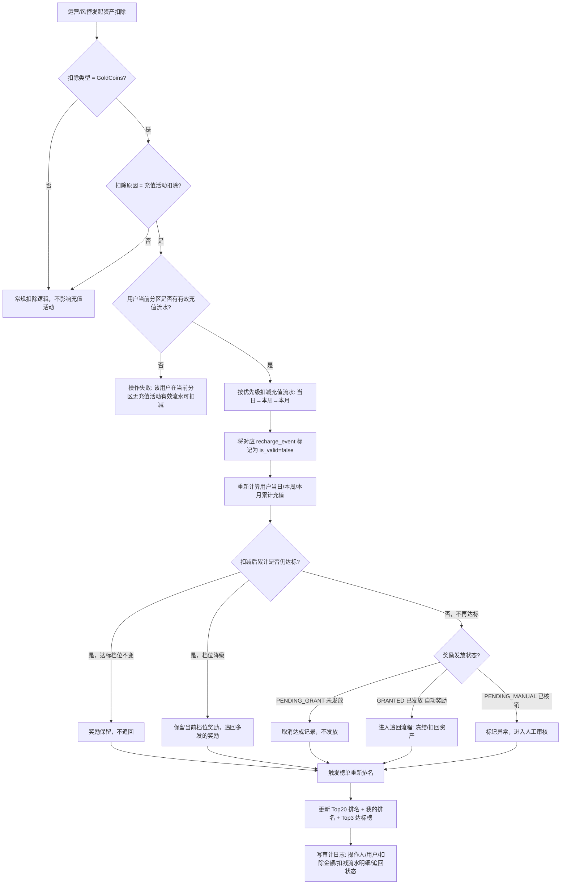
```mermaid
flowchart TD
    A[运营/风控发起资产扣除] --> B{扣除类型 = GoldCoins?}
    B -->|否| Z1[常规扣除逻辑，不影响充值活动]
    B -->|是| C{扣除原因 = 充值活动扣除?}
    C -->|否| Z1
    C -->|是| D{用户当前分区是否有有效充值流水?}
    D -->|否| Z2[操作失败: 该用户在当前分区无充值活动有效流水可扣减]
    D -->|是| E[按优先级扣减充值流水: 当日→本周→本月]

    E --> F[将对应 recharge_event 标记为 is_valid=false]
    F --> G[重新计算用户当日/本周/本月累计充值]
    G --> H{扣减后累计是否仍达标?}

    H -->|是，达标档位不变| I[奖励保留，不追回]
    H -->|是，档位降级| J[保留当前档位奖励，追回多发的奖励]
    H -->|否，不再达标| K{奖励发放状态?}

    K -->|PENDING_GRANT 未发放| L[取消达成记录，不发放]
    K -->|GRANTED 已发放 自动奖励| M[进入追回流程: 冻结/扣回资产]
    K -->|PENDING_MANUAL 已核销| N[标记异常，进入人工审核]

    I --> O[触发榜单重新排名]
    J --> O
    L --> O
    M --> O
    N --> O

    O --> P[更新 Top20 排名 + 我的排名 + Top3 达标榜]
    P --> Q[写审计日志: 操作人/用户/扣除金额/扣减流水明细/追回状态]
```

#### 充值活动扣除流水扣减流程图

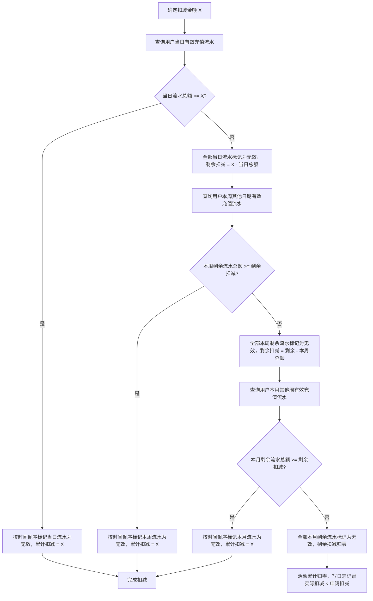
```mermaid
flowchart TD
    A[确定扣减金额 X] --> B[查询用户当日有效充值流水]
    B --> C{当日流水总额 >= X?}
    C -->|是| D[按时间倒序标记当日流水为无效，累计扣减 = X]
    C -->|否| E[全部当日流水标记为无效，剩余扣减 = X - 当日总额]
    E --> F[查询用户本周其他日期有效充值流水]
    F --> G{本周剩余流水总额 >= 剩余扣减?}
    G -->|是| H[按时间倒序标记本周流水为无效，累计扣减 = X]
    G -->|否| I[全部本周剩余流水标记为无效，剩余扣减 = 剩余 - 本周总额]
    I --> J[查询用户本月其他周有效充值流水]
    J --> K{本月剩余流水总额 >= 剩余扣减?}
    K -->|是| L[按时间倒序标记本月流水为无效，累计扣减 = X]
    K -->|否| M[全部本月剩余流水标记为无效，剩余扣减归零]
    M --> N[活动累计归零，写日志记录实际扣减 < 申请扣减]

    D --> O[完成扣减]
    H --> O
    L --> O
```

#### 服务端核心逻辑

- 扣除原因选择"充值活动扣除"时，扣除类型必须为 GoldCoins，否则操作失败并提示"充值活动扣除仅支持金币类型"。
- 扣减流水时按时间倒序（最新到最旧）标记无效，优先扣减最新周期的流水。
- 每条被标记为无效的 recharge_event 必须记录 invalid_reason = "recharge_activity_deduction" 和关联的后台操作日志 ID。
- 扣减完成后立即触发：周期累计重算 → 档位达成重判 → 榜单重排 → Top3 达标榜更新。
- 档位奖励追回为异步处理，不阻塞扣除操作本身；追回结果写审计日志。
- 已冻结的历史榜单快照不受影响，只影响当前未冻结周期的实时数据。
- <span style="color:red"><strong>【红线】只有扣除原因为"充值活动扣除"才会触发充值活动流水扣减和榜单重排。其他扣除原因（非法获取、操作错误等）不触发任何充值活动联动逻辑。</strong></span>

#### 权限控制

| 角色 | 是否可操作 | 限制 |
|---|---:|---|
| 风控 | 是 | 主要操作角色，用于刷榜/违规场景 |
| 运营 | 是 | 需二次确认弹窗，显示扣减影响范围（档位、榜单、奖励追回） |
| 客服 | 否 | 无权发起充值活动扣除，只能查看 |
| 财务 | 是 | 可查看扣减记录和追回状态 |
| 普通用户 | 否 | 无后台权限 |

#### 操作确认与二次校验

选择"充值活动扣除"并点击确定后，系统弹出二次确认弹窗：

| 确认项 | 说明 |
|---|---|
| 扣除用户 | 显示用户 ID 和昵称 |
| 扣除金额 | 显示本次扣除的金币数量 |
| 影响范围 | 显示将被扣减的充值流水条数、涉及周期（日/周/月） |
| 档位影响 | 显示可能降级或取消的档位 |
| 奖励追回 | 显示可能被追回的奖励项 |
| 榜单影响 | 提示"扣减后将触发榜单重新排名" |

运营/风控必须确认以上信息后才可执行扣除。

#### 边界条件

| 场景 | 处理规则 |
|---|---|
| 扣除数量为 0 或负数 | 操作失败，提示"扣除数量必须大于 0" |
| 批量扣除中部分用户无活动流水 | 跳过无流水用户，其余正常扣减；结果中分别标注成功/失败 |
| 扣除时活动已结束 | 仍可扣减，影响历史累计记录但不修改已冻结快照 |
| 扣除时用户正在充值 | 扣减先执行，新充值事件后到账，两者独立处理 |
| 同一用户同一天被多次充值活动扣除 | 每次独立扣减流水，可能出现累计归零后再次扣减失败 |
| 扣除后用户档位从高档降到低档 | 按实际累计重新判断，只保留当前档位奖励 |

#### 审计日志

每笔充值活动扣除操作必须记录：

| 字段 | 说明 |
|---|---|
| 操作ID（operation_id） | 唯一操作 ID |
| 操作人（operator_id） | 后台账号 ID |
| 操作时间（operated_at） | 操作时间 |
| 目标用户ID（target_user_ids） | 扣除用户 ID 列表 |
| 扣除金额（deduct_amount） | 申请扣除金币数量 |
| 实际扣减流水金额（actual_deducted） | 实际扣减的充值流水金额 |
| 扣减流水明细（deducted_event_ids） | 被标记无效的 recharge_event ID 列表 |
| 档位影响（tier_impact） | 档位变更情况 |
| 奖励追回状态（reward_recovery_status） | 追回执行状态 |
| 扣除原因（deduct_reason） | recharge_activity_deduction |

---

## 19. 数据结构建议

### 19.1 activity_config 活动配置表

| 字段 | 类型 | 说明 |
|---|---|---|
| 活动ID（activity_id） | string | 活动 ID |
| name | string | 活动名称 |
| 时区（timezone） | string | UTC+3 |
| 活动开始时间（start_time） | datetime | 开始时间 |
| 活动结束时间（end_time） | datetime | 结束时间 |
| 展示截止时间（display_end_time） | datetime | 展示截止 |
| 人工权益领取截止时间（reward_deadline） | datetime | 领奖截止 |
| 活动状态（status） | enum | Draft/Scheduled/Online/Ended/Archived |
| created_at | datetime | 创建时间 |
| updated_at | datetime | 更新时间 |

### 19.2 recharge_event 充值事件表

| 字段 | 类型 | 说明 |
|---|---|---|
| 事件ID（event_id） | string | 到账事件 ID |
| 原始订单ID（raw_order_id） | string | 原订单 ID |
| 用户ID（user_id） | string | 接收方用户 |
| 到账金币数（amount_coin） | integer | 到账金币 |
| 来源类型（source_type） | enum | 来源类型：official / third_party_link / merchant_trade / merchant_self_recharge / advance_credit / loan_credit / withdrawal_to_coin / diamond_exchange / crystal / operation / refund |
| 卖方ID（seller_user_id） | string | 卖方 |
| 买方ID（buyer_user_id） | string | 买方 |
| 接收方账号类型（receiver_account_type） | enum | 接收方账号类型 |
| 活动分区（region） | enum | 到账时分区 |
| 是否有效（is_valid） | boolean | 是否有效 |
| 无效原因（invalid_reason） | string | 无效原因 |
| 到账时间（arrived_at） | datetime | 到账时间 |

### 19.3 recharge_period_summary 周期累计表

| 字段 | 类型 | 说明 |
|---|---|---|
| 用户ID（user_id） | string | 用户 ID |
| 活动ID（activity_id） | string | 活动 ID |
| 活动分区（region） | enum | 分区 |
| 周期类型（period_type） | enum | Daily/Weekly/Monthly |
| period_id | string | 周期 ID |
| 累计金币（total_coin） | integer | 累计金币 |
| updated_at | datetime | 更新时间 |

### 19.4 tier_achievement 档位达成表

| 字段 | 类型 | 说明 |
|---|---|---|
| 用户ID（user_id） | string | 用户 ID |
| 活动ID（activity_id） | string | 活动 ID |
| 活动分区（region） | enum | 分区 |
| 周期类型（period_type） | enum | 周期类型 |
| period_id | string | 周期 ID |
| 档位ID（tier_id） | string | 档位 ID |
| 首次达成时间（毫秒） | datetime/ms | 首次达成时间 |
| 达成时累计金币（reach_amount_coin） | integer | 达成时累计金币 |
| reward_status | enum | 奖励状态 |

### 19.5 ranking_snapshot 榜单快照表

| 字段 | 类型 | 说明 |
|---|---|---|
| 快照ID | string | 快照 ID |
| 活动ID（activity_id） | string | 活动 ID |
| 排名类型 | enum | Weekly/Monthly |
| period_id | string | 周期 ID |
| 活动分区（region） | enum | 分区 |
| frozen_at | datetime | 冻结时间 |
| 排名 | integer | 排名 |
| 用户ID（user_id） | string | 用户 ID |
| 累计金币（total_coin） | integer | 累计金币 |
| reward_group | enum | Top1/Top2-3/Top4-8/none |
| reward_status | enum | 发奖状态 |

### 19.6 reward_grant 奖励发放表

| 字段 | 类型 | 说明 |
|---|---|---|
| 发放ID（grant_id） | string | 发放记录 ID |
| idempotent_key | string | 幂等键 |
| 用户ID（user_id） | string | 用户 ID |
| 活动ID（activity_id） | string | 活动 ID |
| reward_source | enum | tier/ranking |
| 奖励项ID（reward_item_id） | string | 奖励项 ID |
| 发放方式（grant_method） | enum | auto/service/operation |
| 发放状态（grant_status） | enum | pending/granting/success/partial_success/waiting_claim/claimed/failed/expired/revoked |
| 发放时间（granted_at） | datetime | 发放时间 |
| expire_at | datetime | 过期时间 |
| operator | string | 操作人 |

---

## 21. 异常场景与处理

| 异常场景 | 处理规则 | 用户提示 |
|---|---|---|
| 网络失败 | 保留当前页面，提示重试 | Network error, please try again |
| 榜单加载失败 | 展示错误态和重试按钮 | Failed to load ranking |
| 我的累计充值加载失败 | 展示占位和重试按钮 | Failed to load data |
| 充值到账延迟 | 不计入直到到账事件产生 | 规则页说明以到账时间为准 |
| 奖励发放失败 | 后台告警并重试 | 不直接暴露失败 |
| 人工权益过期 | 状态变 Expired | 通知用户权益过期 |
| 用户被风控 | 取消资格或标记异常 | 按风控策略提示 |
| 活动已结束 | 停止累计，允许看历史 | Activity ended |

---

## 22. 权限与风控

### 22.1 用户限制

| 用户类型 | 是否参与 | 说明 |
|---|---:|---|
| 普通用户 | 是 | 正常参与 |
| 代理账号 | 有效金币到账计入 | 单纯水晶侧变动不参与；若产生金币到账，则按接收方计入 |
| 币商账号 | 有效金币到账计入 | 币商给自己充值金币也计入；异常刷流水走风控判定 |
| 官方账号 | 否 | 不参与活动 |
| 风控黑名单用户 | 否 | 不参与活动或取消资格 |

### 22.2 风控触发条件

| 条件 | 处理 |
|---|---|
| 自买自卖刷流水 | 默认先计入有效金币到账，命中风控后可标记待审、回滚累计或取消资格 |
| 退款/撤销 | 回滚累计或追加异常 |
| 大额异常充值 | 标记待审核 |
| 短时间高频交易 | 标记待审核 |
| 运营确认刷榜 | 清空活动数据/取消奖励 |

---

## 24. 逻辑冲突审计结果

### 24.1 已修正 P0

| 问题 | 原风险 | 本 PRD 修正 |
|---|---|---|
| 周期结束清空 vs 次日发奖 | 发奖依据丢失 | 改为前端切新周期，后端冻结快照 |
| 币商/代理/金币到账口径冲突 | 刷榜、统计错误 | 拆成充值事件计入口径表 |
| 分区只写一句 | 榜单和发奖混乱 | 分区贯穿奖励、榜单、历史、快照 |
| 立即发奖 vs 客服领取冲突 | 定制权益误发 | 拆自动奖励和待领取权益 |
| 排行榜排序缺失 | Top 奖励争议 | 补完整排序兜底 |
| 单笔跨档未定义 | 奖励成本和投诉风险 | 明确补发所有新达成档位 |
| 日/周/月叠加未定义 | 成本和用户预期风险 | 默认建议允许叠加 |

### 24.2 已修正 P1

| 问题 | 本 PRD 修正 |
|---|---|
| 24:00 时间边界 | 全部改为左闭右开 |
| Top3 同秒同等级 | 增加累计金额和 user_id 兜底 |
| 每小时刷新 vs 即时发奖 | 拆不同数据刷新策略 |
| 奖励资产规则不明 | 增加奖励项字段和叠加/撤销规则 |
| 历史只展示 Top3 | 支持展开 Top8 / 本人历史排名 |
| 系统通知太粗 | 增加发奖状态机和通知场景 |
| 活动起止时间缺失 | 增加活动配置和状态机 |

---

## 25. 源材料覆盖核对

| 原始需求点 | 来源 | 本 PRD 位置 | 覆盖状态 |
|---|---|---|---|
| 首页 Banner 入口 | stay项目组.pdf | 7.1 | 已覆盖 |
| 房间悬浮窗入口 | stay项目组.pdf | 7.1 | 已覆盖 |
| 默认进入 Recharge Reward | stay项目组.pdf | 7.2 | 已覆盖 |
| 顶部 Rule | stay项目组.pdf | 7.3 / 14 | 已覆盖 |
| 当月 Top1 固定展示 | stay项目组.pdf | 7.4 | 已覆盖并补分区 |
| Daily/Weekly/Monthly | stay项目组.pdf | 8 / 4 | 已覆盖并补周期定义 |
| 我的累计充值 | stay项目组.pdf | 8.3 | 已覆盖 |
| 进度条和档位节点 | stay项目组.pdf | 8.4 | 已覆盖 |
| 档位奖励卡片 | stay项目组.pdf | 8.5 / 9 | 已覆盖并补字段 |
| Top3 达标规则 | stay项目组.pdf | 10 | 已覆盖并补排序兜底 |
| 周/月排行榜 | 充值页面-榜单.pdf | 11 | 已覆盖 |
| 倒计时结束刷新 | 充值页面-榜单.pdf | 11.6 / 12 | 已修正为快照 |
| Top20 榜单 | 充值页面-榜单.pdf | 11.4 | 已覆盖 |
| 我的排名条 | 充值页面-榜单.pdf | 11.5 | 已覆盖 |
| 周历史近 3 周 | 充值页面-榜单历史.pdf | 13 | 已覆盖 |
| 月历史近 3 月 | 充值页面-榜单历史.pdf | 13 | 已覆盖 |
| 档位奖励表 | 充值档位.pdf | 9 | 已抽象为配置表，具体数值待原表二次确认 |
| 周/月排行奖励 | 充值档位.pdf | 12 | 已覆盖 |
| 币商充值计入 | stay项目组.pdf | 6 | 已覆盖并修正口径 |
| 水晶侧变动与金币到账区分 | stay项目组.pdf | 6 | 已覆盖；单纯水晶不计入，钻石兑换/金币到账计入 |
| 分英语区和阿语区 | stay项目组.pdf | 5 | 已覆盖并闭环 |

---

## 26. 待产品最终确认项

以下问题必须在开发排期前确认，别留到上线前撕逼。

| 编号 | 问题 | 本 PRD 默认建议 | 必须确认原因 |
|---:|---|---|---|
| 1 | 日/周/月档位奖励是否允许叠加（同一笔充值同时计入三周期） | 允许叠加 | 影响奖励成本；叠加≠重复领取，见第2项 |
| 2 | Daily 档位奖励发放规则（每日0点发放昨日达标奖励） | 允许每日重复领取 | 已改为每日0点发放昨日达标奖励；成本影响：30天×4档=120次 vs 整个活动期只发4次，差30倍 |
| 3 | EN/AR 是否独立发排行奖励 | 独立发 | 影响奖池数量 |
| 4 | 币商账号本人是否可参与 | 参与，有效金币到账计入 | 币商给自己充值金币也需要进入充值统计，但异常刷流水需风控处理 |
| 5 | 运营后台加金币是否计入 | 仅“线下充值”类型加币成功计入；其他后台加金币类型不计入 | 防人工调账、补偿、测试加币混入充值活动累计 |
| 6 | 退款后自动奖励是否追回 | 按奖励类型追回/冻结/人工审 | 影响风控执行 |
| 7 | Pretty ID/靓号领取截止时间 | 人工权益领取截止时间（reward_deadline） | 影响客服核销 |
| 8 | 历史榜单是否开放 Top8 | 建议开放 | 奖励覆盖 Top4-8 |
| 9 | 活动上线首日是否从当天 0 点补算 | 默认不补，取活动有效期交集 | 影响首日统计 |
| 10 | 周/月榜 Top20 是否展示金币数 | 建议展示 | 用户冲榜需要明确差距 |
| 11 | 奖励档位具体数值 | 需基于原始档位表二次确认 | PDF OCR 表格不完整 |

---

## 27. 交付结论

这版 PRD 已把原始“页面描述型需求”重构为“可开发业务规则型 PRD”。

后续不建议再沿用原始 PDF 文案直接开发。

优先补三件事：

1. 充值档位奖励表的精确数值与资产 ID。
2. EN/AR 两区奖池和预算确认。
3. 退款、刷榜、人工权益领取的运营 SOP。