# 充值活动业务流程图与坑点表

审计来源：`/Users/mac/Downloads/充值活动`

目标：把当前需求从“散点描述”整理成开发、产品、运营能对齐的业务流程图和表格。

---

## 1. 活动主链路总览

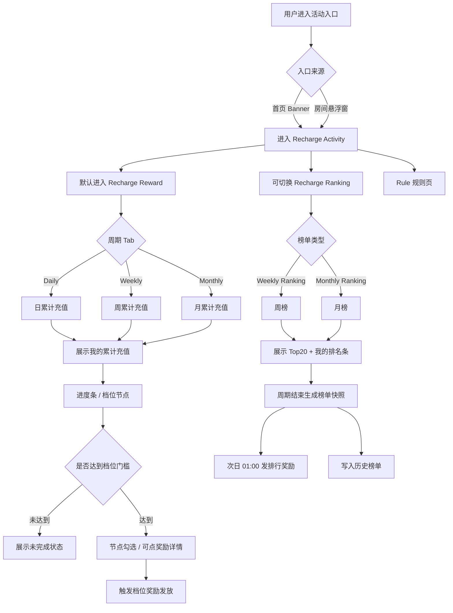

### 当前缺口

| 环节 | 当前文档有没有 | 问题 |
|---|---:|---|
| 活动入口 | 有 | OK |
| 默认落地页 | 有 | OK |
| 日/周/月切换 | 有 | OK |
| 档位达成 | 有 | 但跨档、重复发、撤销没写 |
| 周/月榜单 | 有 | 但排序规则不完整 |
| 周期结束 | 有 | 写了清空上周期数据，危险 |
| 快照归档 | 没有 | 发奖和历史榜单没依据 |
| 次日发奖 | 有 | 但和“清空数据”冲突 |
| 分区 | 只写一句 | 没贯穿榜单/奖励/历史 |

---

## 2. 充值金额统计流程

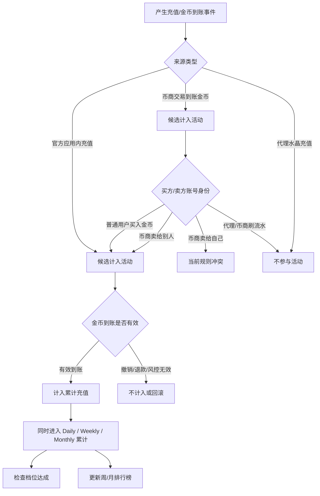

### 充值统计口径决策表

| 场景 | 当前文档倾向 | 是否冲突 | 建议最终规则 |
|---|---|---:|---|
| 官方应用内充值到账金币 | 计入 | 否 | 计入 |
| 普通用户通过币商买金币 | 计入 | 否 | 计入 |
| 币商卖给别人产生金币到账 | 计入 | 低 | 计入买方，不计入卖方 |
| 币商卖给自己产生金币到账 | 文档写计入 | 高 | 建议不计入，防刷流水 |
| 代理水晶充值 | 文档写不参与 | 否 | 不计入 |
| 充值退款 / 撤销 | 未写 | 高 | 未发不发，已发进入追回/风控流程 |
| 到账时间跨周期边界 | 写按到账时间 | 中 | 按 UTC+3 到账时间进入对应周期 |

### 这里最该补一句

> 活动累计充值以“有效金币到账事件”为准；统计对象为金币接收方。代理/币商账号自身通过水晶或自买自卖产生的金币到账不计入活动，防止刷流水。

---

## 3. 日/周/月周期模型

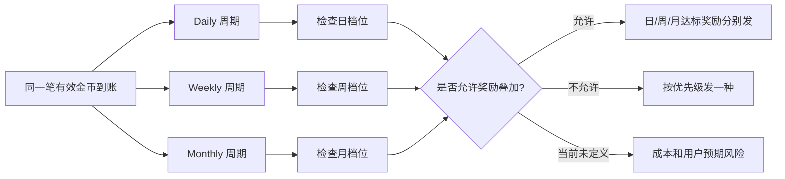

### 周期表

| 周期 | 当前写法 | 建议开发实现 | 坑点 |
|---|---|---|---|
| 日累计 | 每日 00:00:00 ～ 24:00:00 | `[当天 00:00:00, 次日 00:00:00)` | 别写 24:00:00，容易边界炸 |
| 周累计 | 周一 00:00 ～ 周日 24:00 | `[周一 00:00:00, 下周一 00:00:00)` | 周日 24:00 等于周一 00:00 |
| 月累计 | 1 日 00:00 ～ 月末 24:00 | `[当月 1 日 00:00:00, 次月 1 日 00:00:00)` | 月末 24:00 容易错算 |
| 时区 | UTC+3 | 所有周期 ID 按 UTC+3 生成 | 前后端必须一致 |
| 活动上线首日 | 未写 | `自然周期 ∩ 活动有效期` | 上线前充值算不算没定义 |

---

## 4. 档位奖励发放流程

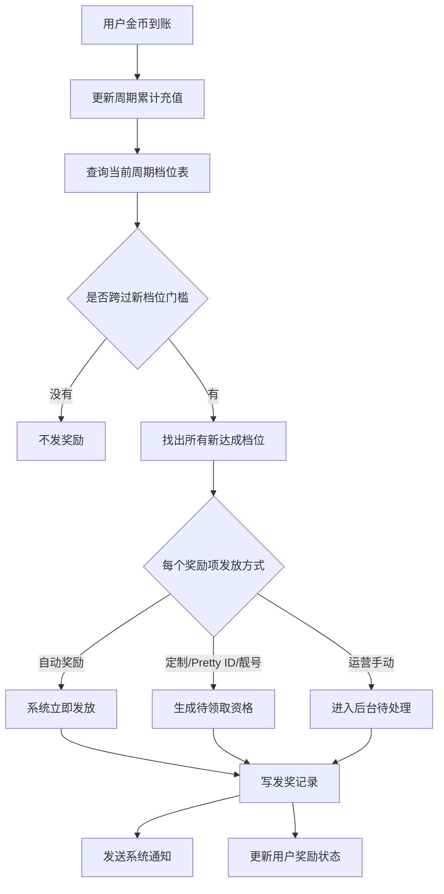

### 档位奖励必须补齐的字段

| 字段 | 说明 | 不写会怎样 |
|---|---|---|
| period_type | Daily / Weekly / Monthly | 不知道属于哪个周期 |
| tier_id | 档位 ID | 无法做幂等 |
| threshold_coin | 金币门槛 | 无法判断达成 |
| threshold_usd | 美金展示值 | 前端展示用，不能替代金币统计 |
| reward_item_id | 奖励项 ID | 无法发具体资产 |
| reward_type | VIP / 头像框 / 气泡 / 靓号等 | 资产系统不知道发啥 |
| amount | 数量 | VIP2*7 到底 7 是天数还是数量不清楚 |
| valid_days | 有效期 | 道具过期规则缺失 |
| grant_method | 自动 / 客服 / 运营手动 | 防止定制权益被自动发 |
| stack_rule | 叠加 / 覆盖 / 延长 / 并存 | 老资产和新资产冲突 |
| revoke_rule | 退款后追回 / 不追回 / 人工处理 | 风控争议 |

### 跨档发奖决策表

| 场景 | 当前文档 | 建议规则 |
|---|---|---|
| 用户从 0 一次充到最高档 | 没写 | 补发所有新达成档位，而不是只发最高档 |
| 同周期重复达到同档 | 没写 | 同一周期同一档位只发一次 |
| 日/周/月同时达标 | 没写 | 明确是否三周期奖励可叠加 |
| 自动奖励 + 定制奖励混在同档 | 有冲突 | 自动奖励立即发，定制奖励生成待领取资格 |
| 退款/风控撤销后 | 没写 | 已发奖励进入追回/冻结/人工审核流程 |

---

## 5. Top3 达标榜流程

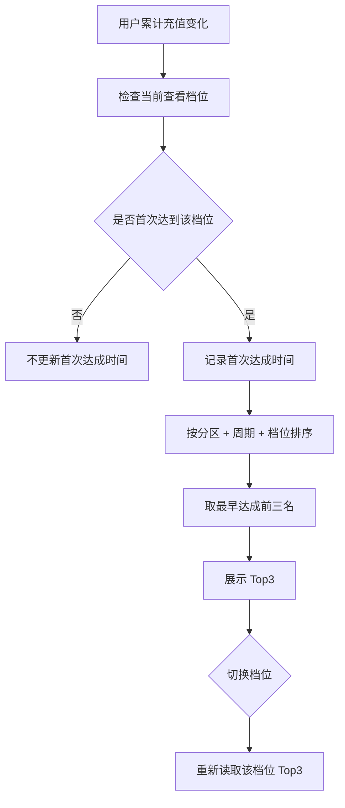

### Top3 排序规则建议

| 排序优先级 | 字段 | 方向 | 说明 |
|---:|---|---|---|
| 1 | first_reach_time_ms | 升序 | 谁先达成谁靠前 |
| 2 | wealth_level | 降序 | 同时间按财富等级 |
| 3 | current_recharge_amount | 降序 | 同财富等级按累计充值 |
| 4 | user_id | 升序 | 最终兜底，保证稳定 |

### 当前坑点

| 问题 | 风险 |
|---|---|
| 只写同秒按财富等级 | 同秒同等级会撞车 |
| 没写毫秒级时间 | 秒级不够用 |
| 没写首次达成时间落库 | 实时计算会漂 |
| 没写分区 Top3 | 英语区/阿语区展示混乱 |
| 没写周期结束后是否冻结 | 历史和发奖对不上 |

---

## 6. 周/月排行榜流程

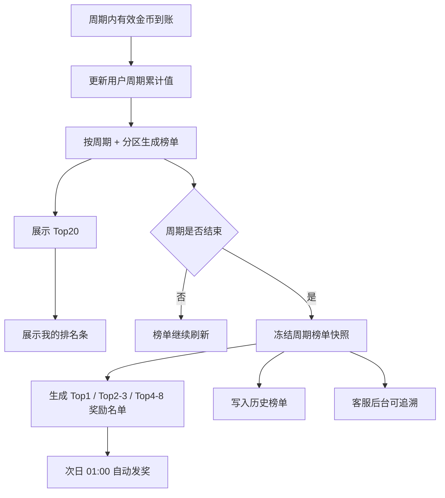

### 排行榜排序建议

| 排序优先级 | 字段 | 方向 | 说明 |
|---:|---|---|---|
| 1 | period_recharge_coin | 降序 | 累计有效到账金币越高越靠前 |
| 2 | reach_current_amount_time | 升序 | 同金额先达到者靠前 |
| 3 | wealth_level | 降序 | 再按财富等级 |
| 4 | user_id | 升序 | 最终兜底 |

### 排行榜字段表

| 区域 | 字段 | 当前文档 | 建议补充 |
|---|---|---|---|
| 榜单行 | 头像 | 有 | OK |
| 榜单行 | 昵称 | 有 | OK |
| 榜单行 | 排名 | UI隐含 | 明确写 |
| 榜单行 | 累计充值值 | 我的排名条有 | 榜单行也建议展示 |
| 榜单行 | 分区 | 没写 | 英语区/阿语区必须落字段 |
| 我的排名条 | 我的排名 | 有 | 未上榜显示 20+ |
| 我的排名条 | 我的累计充值 | 有 | 单位金币/美金要明确 |
| 我的排名条 | Recharge 按钮 | 有 | 跳转充值页 |
| 快照 | 周期 ID | 没写 | 必须有 |
| 快照 | 排名快照时间 | 没写 | 必须有 |
| 快照 | 发奖状态 | 没写 | 必须有 |

---

## 7. 周期结束与发奖冲突图

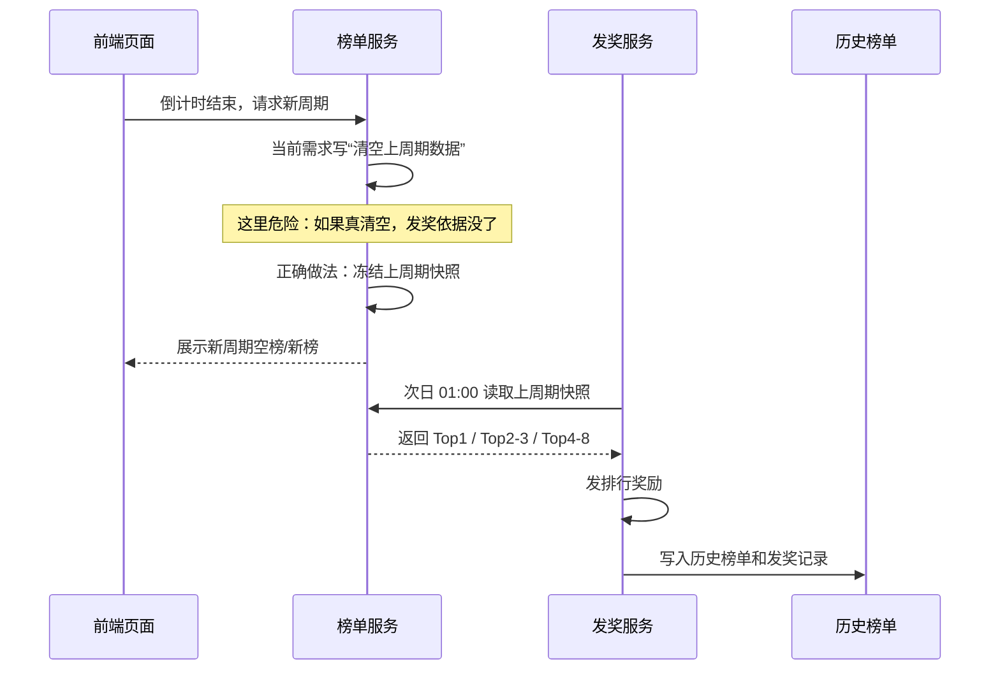

### 关键修正

| 当前写法 | 风险 | 正确写法 |
|---|---|---|
| 倒计时结束清空上周期数据 | 发奖依据丢失 | 前端切新周期展示，后端冻结旧周期快照 |
| 次日 01:00 自动发奖 | 如果无快照会漂 | 发奖读取不可变快照 |
| 历史榜单展示 Top3 | Top4-8 无法追溯 | 历史至少保存 Top8 / 完整 Top20 快照 |

---

## 8. 英语区 / 阿语区分区流程

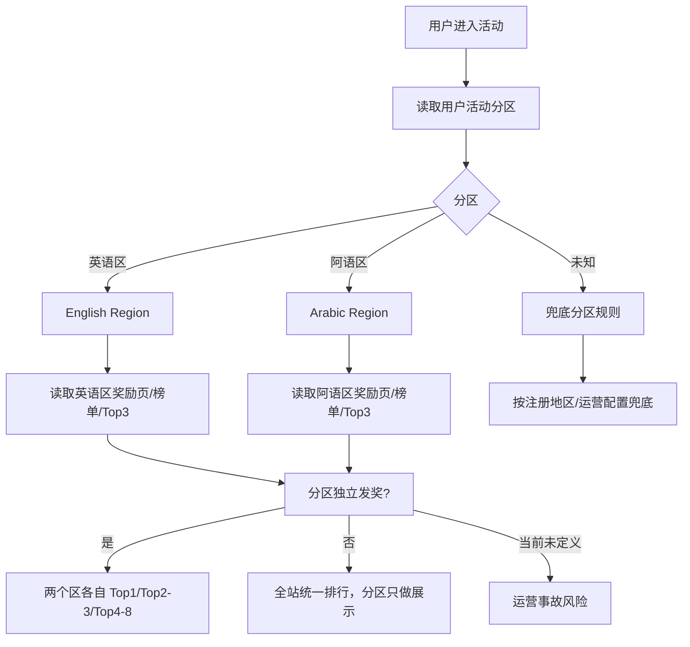

### 分区规则必须定死

| 问题 | 建议答案 |
|---|---|
| 分区来源是什么 | 注册地区 / 运营配置，别跟随语言随便变 |
| 首页当月 Top1 是哪个区 | 建议当前用户所在区 Top1 |
| Top3 达标榜是否分区 | 建议分区独立 |
| 周榜/月榜是否分区 | 建议分区独立 |
| 排行奖励是否分区发两套 | 必须明确，建议两区独立发 |
| 历史榜单是否分区 | 必须分区保存 |
| 用户分区变更后历史怎么算 | 历史按当期快照分区，不追溯 |

---

## 9. 历史榜单流程

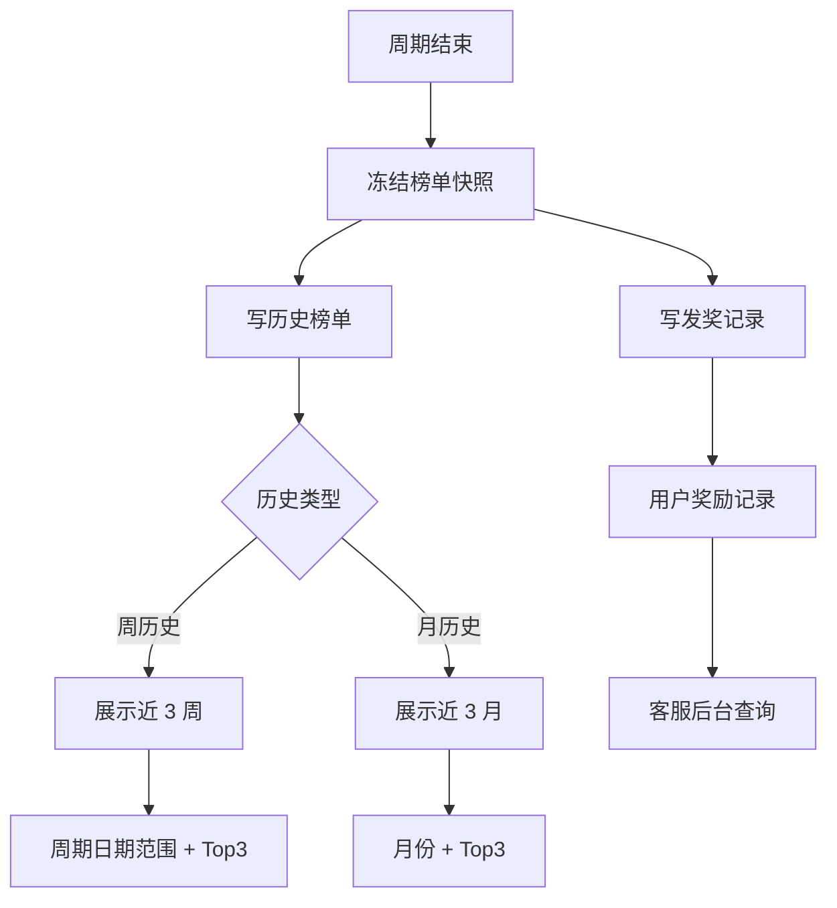

### 历史榜单建议补充

| 当前文档 | 问题 | 建议 |
|---|---|---|
| 周历史近 3 周 Top3 | Top4-8 奖励用户不可见 | 支持展开 Top8 或展示本人历史排名 |
| 月历史近 3 月 Top3 | 同上 | 同上 |
| 没写分区 | 历史榜单会混区 | 历史按分区保存 |
| 没写发奖状态 | 用户不知道奖发没发 | 展示本人奖励状态 |
| 没写快照 | 投诉无法追溯 | 保存完整 Top20 快照 |

---

## 10. P0/P1 坑点总表

| 编号 | 坑点 | 风险等级 | 影响范围 | 必须补的规则 |
|---:|---|---|---|---|
| 1 | 清空上周期数据 vs 次日发奖冲突 | P0 | 排行奖励、历史榜单、客服对账 | 周期结束冻结快照，不能物理清空 |
| 2 | 金币到账 / 充值金额 / 币商 / 代理口径冲突 | P0 | 充值统计、排行榜、风控 | 明确计入主体和来源类型 |
| 3 | 分区只写一句，没有贯穿业务 | P0 | 榜单、Top1、Top3、发奖、历史 | 定义 region 维度和分区发奖策略 |
| 4 | 立即发奖 vs 定制类联系客服冲突 | P0 | 奖励发放、客服核销 | reward_item 增加 grant_method |
| 5 | 周/月榜排序规则缺失 | P0 | Top1/Top2-3/Top4-8 发奖 | 定义金额榜排序与兜底排序 |
| 6 | 单笔充值跨多档没规则 | P0 | 档位奖励成本、用户权益 | 新达成档位逐个补发，每档每周期一次 |
| 7 | 日/周/月奖励是否叠加没写 | P0 | 奖励成本、用户预期 | 明确三周期是否可同时发奖 |
| 8 | 24:00:00 时间边界 | P1 | 周期统计 | 改成左闭右开区间 |
| 9 | Top3 同秒同等级无兜底 | P1 | Top3 展示、奖励争议 | 增加累计金额/user_id兜底 |
| 10 | 页面每小时刷新 vs 实时发奖 | P1 | 用户体验、客服咨询 | 我的进度即时刷新，榜单可定时刷新 |
| 11 | 奖励资产叠加/覆盖/有效期没写 | P1 | VIP、头像框、气泡等资产 | 定义 stack_rule / valid_days |
| 12 | 历史只展示 Top3 但奖励到 Top8 | P1 | 用户自证、客服追溯 | 历史支持 Top8 或本人历史排名 |
| 13 | 系统通知状态太粗 | P1 | 通知、售后 | 拆自动到账/待领取/失败/撤销 |
| 14 | 活动起止时间没写 | P1 | 上线首日、活动结束、配置变更 | 定义活动有效期和配置快照 |

---

## 11. 推荐落库对象表

### 11.1 充值事件表

| 字段 | 说明 |
|---|---|
| event_id | 金币到账事件 ID |
| user_id | 金币接收方 |
| amount_coin | 到账金币数 |
| source_type | 官方充值 / 币商交易 / 水晶交易 / 运营调整 |
| seller_user_id | 币商/卖方，可空 |
| buyer_user_id | 买方 |
| account_type | 普通用户 / 代理 / 币商 |
| is_valid | 是否有效 |
| invalid_reason | 退款 / 撤销 / 风控 / 其他 |
| arrived_at | UTC+3 对应到账时间 |
| raw_order_id | 原始订单 ID |

### 11.2 周期累计表

| 字段 | 说明 |
|---|---|
| user_id | 用户 |
| region | 英语区 / 阿语区 |
| period_type | Daily / Weekly / Monthly |
| period_id | 例如 2026-05-08 / 2026-W19 / 2026-05 |
| total_coin | 有效累计金币 |
| first_reach_times | 各档位首次达成时间 |
| updated_at | 更新时间 |

### 11.3 档位达成表

| 字段 | 说明 |
|---|---|
| user_id | 用户 |
| region | 分区 |
| period_type | 周期类型 |
| period_id | 周期 ID |
| tier_id | 档位 ID |
| threshold_coin | 门槛金币 |
| first_reach_time | 首次达成时间，毫秒级 |
| reach_amount_coin | 达成时累计金币 |
| reward_status | 未发 / 发放中 / 已发 / 部分发 / 待领取 / 失败 / 已撤销 |

### 11.4 榜单快照表

| 字段 | 说明 |
|---|---|
| snapshot_id | 快照 ID |
| region | 分区 |
| rank_type | Weekly / Monthly |
| period_id | 周期 ID |
| frozen_at | 冻结时间 |
| rank_no | 排名 |
| user_id | 用户 |
| total_coin | 周期累计金币 |
| reward_group | Top1 / Top2-3 / Top4-8 / none |
| reward_status | 发奖状态 |

### 11.5 奖励发放记录表

| 字段 | 说明 |
|---|---|
| grant_id | 发放记录 ID |
| idempotent_key | 幂等键 |
| user_id | 用户 |
| reward_source | tier / ranking |
| reward_item_id | 奖励项 ID |
| grant_method | 自动 / 客服 / 运营手动 |
| grant_status | 待发 / 发放中 / 成功 / 失败 / 待领取 / 已核销 / 已撤销 |
| granted_at | 发放时间 |
| expire_at | 过期时间 |
| operator | 操作人，自动为 system |

---

## 12. 最小可开发闭环

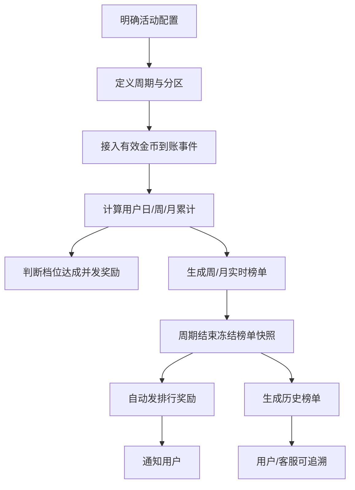

### 开发前必须拍板的 10 个问题

| 编号 | 问题 | 不拍板的后果 |
|---:|---|---|
| 1 | 英语区/阿语区是否独立发奖？ | 奖励名单混乱 |
| 2 | 币商卖给自己是否计入？ | 刷榜风险 |
| 3 | 日/周/月奖励是否可叠加？ | 成本失控或用户投诉 |
| 4 | 单笔跨多档发所有档还是最高档？ | 发奖争议 |
| 5 | 退款/撤销后奖励是否追回？ | 风控无法落地 |
| 6 | Top3 同秒同等级怎么排？ | 排名不稳定 |
| 7 | 周/月榜同金额怎么排？ | Top1 争议 |
| 8 | 定制奖励怎么领取、何时过期？ | 客服无法核销 |
| 9 | 历史榜单是否展示 Top8/本人排名？ | 用户无法自证 |
| 10 | 活动上线首日是否补算当天 0 点后数据？ | 首日统计争议 |

---

## 13. 一句话结论

这需求不是“画几个充值榜页面”这么简单。

真正的系统核心是：

```text
有效金币到账事件
  → 按 UTC+3 落入日/周/月周期
  → 按分区累计
  → 触发档位达成
  → 生成实时榜单
  → 周期结束冻结快照
  → 基于快照发奖
  → 历史榜单和客服对账读取同一快照
```

现在文档最大的问题：页面讲得比规则多，规则又在“发奖、分区、币商、周期边界、榜单快照”这些高风险点上没闭环。

不补这些，开发一定各自脑补。然后上线后用户充值不到账、榜单名次变、Top1 奖励发错，客服直接被打爆。

---

## 14. 虾子版修改建议：把这坨模糊需求改成能开发的规则

这部分不是单纯挑刺，是直接告诉你应该怎么改文档。

当前需求最大的问题：

```text
页面写了，业务没闭环；
奖励写了，发放规则没闭环；
榜单写了，排序和快照没闭环；
分区写了，分区影响范围没闭环；
币商写了，防刷口径没闭环。
```

这玩意儿如果直接给开发，开发只能靠脑补。

脑补开发 = 上线事故预约券。

---

### 14.1 建议一：先补“活动配置总表”

原文现在缺活动级配置，导致上线时间、分区、发奖、历史全都飘。

建议在需求文档最前面加一张活动配置表。

| 配置项 | 建议规则 | 说明 |
|---|---|---|
| 活动名称 | Recharge Activity | 前端标题统一 |
| 活动时区 | UTC+3 | 页面展示、周期计算、发奖任务全部统一 |
| 活动开始时间 | 后台配置 | 未到开始时间不展示或展示预热态 |
| 活动结束时间 | 后台配置 | 结束后停止累计充值 |
| 活动展示结束时间 | 可晚于活动结束时间 | 方便用户看历史和领奖 |
| 发奖截止时间 | 后台配置 | 防止活动结束后无限期补发 |
| 支持分区 | 英语区、阿语区 | 必须成为榜单和奖励维度 |
| 默认落地页 | Recharge Reward | 任意入口进入默认奖励页 |
| 奖励发放模式 | 档位即时发，排行周期后发 | 两套发奖机制必须分开 |
| 历史保留范围 | 近 3 周 / 近 3 月 | 但后台快照建议长期保存 |

建议补充文案：

```text
活动所有统计、展示、倒计时、周期结算、奖励发放均以 UTC+3 为准。
活动累计充值仅统计活动有效期内产生的有效金币到账事件。
若自然周期与活动有效期不完全重合，则统计窗口取二者交集。
```

---

### 14.2 建议二：把“24:00”全改成左闭右开时间

原文写 00:00～24:00，看起来人能懂，但开发落库容易炸。

建议改成：

| 周期 | 原写法 | 建议改法 |
|---|---|---|
| 日累计 | 每日 00:00:00 ～ 24:00:00 | `[当日 00:00:00, 次日 00:00:00)` |
| 周累计 | 周一 00:00 ～ 周日 24:00 | `[周一 00:00:00, 下周一 00:00:00)` |
| 月累计 | 每月 1 日 00:00 ～ 月末 24:00 | `[当月 1 日 00:00:00, 次月 1 日 00:00:00)` |

建议补充文案：

```text
所有统计窗口均采用左闭右开区间，即包含开始时间，不包含结束时间。
例如日周期为 [当天 00:00:00, 次日 00:00:00)，次日 00:00:00 及之后到账的金币计入次日周期。
```

---

### 14.3 建议三：重写充值计入口径，别再“币商/代理/水晶”糊成一锅粥

现在这段最危险。

原文同时出现：

- 官方应用内充值计入
- 币商充值计入
- 代理水晶充值不参与
- 币商卖给自己产生的金币到账计入

这几句话放一起，像四个人在抢方向盘。

建议改成下面这张口径表。

| 事件类型 | 金币接收方 | 金币卖方/来源方 | 是否计入活动 | 计入对象 | 说明 |
|---|---|---|---|---|---|
| 官方应用内充值 | 普通用户 | 官方支付渠道 | 是 | 接收方用户 | 按金币到账时间计入 |
| 币商卖金币给普通用户 | 普通用户 | 币商/代理 | 是 | 接收方用户 | 用户真实买入金币，计入 |
| 币商卖金币给自己 | 币商本人 | 币商本人 | 否 | 无 | 防止自买自卖刷流水 |
| 代理水晶充值 | 代理/币商 | 水晶账户 | 否 | 无 | 代理侧水晶变动不参与 |
| 运营后台加金币 | 任意用户 | 运营后台 | 默认否 | 无 | 如要计入必须配置活动白名单 |
| 退款/撤销订单 | 原接收方 | 原订单 | 回滚 | 原接收方 | 扣减对应周期累计或进入风控处理 |
| 风控判定无效到账 | 任意用户 | 任意来源 | 否 | 无 | 不参与奖励和榜单 |

建议补充文案：

```text
活动累计充值以“有效金币到账事件”为唯一统计依据。
统计对象为金币接收方用户。
代理/币商账号自身因水晶充值、自买自卖、内部调账产生的金币到账，不计入活动累计值，不参与档位奖励和排行榜。
```

---

### 14.4 建议四：分区规则必须贯穿全活动

原文只写“需要分英语区与阿语区”。

这不叫需求，这叫往文档里扔了个雷。

建议明确：分区是活动核心维度，不是页面筛选。

| 模块 | 是否按分区独立 | 建议 |
|---|---:|---|
| Recharge Reward 奖励页 | 是 | 用户看到自己分区的档位进度和 Top3 |
| Top3 达标榜 | 是 | 英语区、阿语区各自一套 Top3 |
| Weekly Ranking | 是 | 两区独立周榜 |
| Monthly Ranking | 是 | 两区独立月榜 |
| 排行奖励 | 是 | 两区分别发 Top1 / Top2-3 / Top4-8 |
| 历史榜单 | 是 | 按分区保存和展示 |
| 首页当月 Top1 | 是 | 展示当前用户所在分区的月 Top1 |
| 后台配置 | 是 | 奖励可全区共用，也可按分区配置 |

建议补充文案：

```text
活动榜单、Top3 达标榜、排行奖励、历史榜单均按分区独立计算。
用户进入活动页时，系统根据用户活动分区展示对应分区数据。
分区来源以后台用户分区配置为准，不随用户前端语言切换实时变化。
若用户分区为空，则按后台兜底分区规则处理。
```

---

### 14.5 建议五：档位奖励要拆“自动发放”和“待领取资格”

原文写：

```text
每达到一个档位门槛，就立即发放该档位奖励。
Pretty ID、定制类奖励需联系客服领取。
```

这两句是冲突的。

建议改成：

| 奖励类型 | 发放方式 | 达标后状态 | 用户感知 |
|---|---|---|---|
| VIP | 自动发放 | 已到账 | 系统通知 |
| 头像框 | 自动发放 | 已到账 | 系统通知 |
| 进场特效 | 自动发放 | 已到账 | 系统通知 |
| 气泡 | 自动发放 | 已到账 | 系统通知 |
| 资料卡装饰 | 自动发放 | 已到账 | 系统通知 |
| 金币奖励 | 自动发放 | 已到账 | 系统通知 |
| 标签/勋章 | 自动发放或运营手动 | 视配置 | 系统通知 |
| Pretty ID | 联系客服领取 | 待领取 | 通知用户联系客服 |
| 靓号 | 联系客服/运营核销 | 待领取 | 通知用户联系客服 |
| Banner / 开机屏 | 运营手动配置 | 待处理 | 客服/运营对接 |

建议补充文案：

```text
档位达成后，系统仅对 grant_method=auto 的奖励项执行即时自动发放。
grant_method=manual_service 或 grant_method=operation 的奖励项，只生成奖励资格，不自动发放实体权益。
用户需联系客服或等待运营处理，后台核销后状态变更为已领取/已配置。
```

---

### 14.6 建议六：明确单笔跨多档怎么发

这个必须补。

否则用户一次充大额，开发不知道发几档。

建议规则：

```text
同一用户在同一分区、同一周期、同一档位下，档位奖励最多发放一次。
当一次金币到账导致用户累计充值同时跨过多个未达成档位时，系统按档位从低到高依次发放所有新达成档位奖励。
已达成并发放过的档位不重复发放。
```

示例表：

| 用户行为 | 原累计 | 新到账 | 新累计 | 应发奖励 |
|---|---:|---:|---:|---|
| 单笔小额充值 | 0 | 500,000 | 500,000 | 发 50 美金档 |
| 单笔跨两档 | 0 | 1,000,000 | 1,000,000 | 发 50 + 100 美金档 |
| 已拿低档后再充值 | 500,000 | 500,000 | 1,000,000 | 只发 100 美金档 |
| 单笔冲到最高档 | 0 | 30,000,000 | 30,000,000 | 发所有新达成档位 |

---

### 14.7 建议七：明确日/周/月奖励是否可叠加

这个是成本大坑。

同一笔充值天然会同时进入日、周、月。

建议产品拍板二选一。

#### 方案 A：允许叠加，用户体验最好，成本最高

```text
同一笔有效金币到账会同时计入 Daily、Weekly、Monthly 三个统计周期。
若该笔到账使用户分别达到日、周、月档位门槛，则对应周期的档位奖励均可获得。
```

#### 方案 B：不允许叠加，成本低，但容易被骂

```text
同一笔有效金币到账同时参与 Daily、Weekly、Monthly 累计展示，但档位奖励仅按最高周期或指定优先级发放。
优先级为 Monthly > Weekly > Daily。
```

虾子建议：

| 维度 | 建议 |
|---|---|
| 如果这是拉充值活动 | 允许叠加 |
| 如果预算很紧 | 不允许叠加，但页面必须写清楚 |
| 如果不想客服爆炸 | 千万别不写 |

---

### 14.8 建议八：排行榜必须冻结快照，别物理清空数据

原文写“倒计时结束切换到新周期并清空上周期数据”。

这句必须改。

它会直接干废次日发奖和历史榜单。

建议改成：

```text
倒计时结束后，前端切换至新周期榜单展示。
后端不得删除或覆盖上周期榜单数据。
系统应在周期结束时生成上周期不可变榜单快照，用于排行奖励发放、历史榜单展示、客服查询和数据对账。
```

快照至少包含：

| 字段 | 说明 |
|---|---|
| snapshot_id | 快照 ID |
| region | 分区 |
| rank_type | Weekly / Monthly |
| period_id | 周期 ID |
| frozen_at | 冻结时间 |
| rank_no | 排名 |
| user_id | 用户 ID |
| nickname_snapshot | 昵称快照 |
| avatar_snapshot | 头像快照 |
| total_coin | 周期累计有效金币 |
| reward_group | Top1 / Top2-3 / Top4-8 / none |
| reward_status | 发奖状态 |

---

### 14.9 建议九：补齐排行榜排序规则

周榜/月榜不能只写展示 20 名。

必须定义排序。

建议规则：

```text
周榜/月榜按用户在当前周期、当前分区内的有效累计金币数降序排名。
若累计金币数相同，则按用户达到该累计值的时间升序排名；仍相同则按财富等级降序；仍相同则按 user_id 升序兜底。
```

排序表：

| 优先级 | 字段 | 方向 |
|---:|---|---|
| 1 | period_total_coin | 降序 |
| 2 | reach_current_amount_time | 升序 |
| 3 | wealth_level | 降序 |
| 4 | user_id | 升序 |

---

### 14.10 建议十：Top3 达标榜要单独定义，不要和排行榜混用

Top3 不是充值金额总榜。

它是“最先达成当前档位的前三名”。

建议补充：

```text
Top3 达标榜按 period_type + period_id + region + tier_id 维度生成。
用户首次达到某档位门槛时，系统记录 first_reach_time。
Top3 展示当前档位下 first_reach_time 最早的前三名用户。
```

排序规则：

| 优先级 | 字段 | 方向 |
|---:|---|---|
| 1 | first_reach_time_ms | 升序 |
| 2 | wealth_level | 降序 |
| 3 | reach_amount_coin | 降序 |
| 4 | user_id | 升序 |

必须补的坑：

| 坑 | 修法 |
|---|---|
| 同秒达成 | 使用毫秒级时间 |
| 同秒同财富等级 | 增加累计金额和 user_id 兜底 |
| 切换档位 Top3 变化 | Top3 维度必须包含 tier_id |
| 分区后 Top3 混乱 | Top3 维度必须包含 region |

---

### 14.11 建议十一：历史榜单别只放 Top3

现在排行奖励覆盖 Top4-8，但历史只展示 Top3。

这也很离谱。

建议改成：

| 页面 | 当前写法 | 建议改法 |
|---|---|---|
| 周历史 | 近 3 周，每条展示 Top3 | 默认展示 Top3，支持展开 Top8 |
| 月历史 | 近 3 月，每条展示 Top3 | 默认展示 Top3，支持展开 Top8 |
| 我的历史 | 没写 | 展示本人当期排名、累计充值、奖励状态 |
| 客服后台 | 没写 | 可查完整 Top20 快照和发奖记录 |

建议补充文案：

```text
历史榜单前端默认展示 Top3；若该周期存在 Top4-8 奖励，则页面应支持查看 Top8 或展示用户本人历史排名与奖励状态。
后台需保存完整 Top20 榜单快照，用于客服查询与奖励对账。
```

---

### 14.12 建议十二：奖励资产规则要独立成表

奖励表不能只写 VIP2*7、款一*1 这种神秘黑话。

产品觉得自己懂，开发不一定懂，资产系统更不懂。

建议奖励配置表加这些字段：

| 字段 | 说明 | 示例 |
|---|---|---|
| reward_item_id | 奖励项 ID | vip_2_7d |
| reward_name | 前端展示名 | VIP2 体验 |
| reward_type | 奖励类型 | VIP / frame / bubble |
| asset_id | 资产系统 ID | 10023 |
| amount | 数量 | 1 |
| valid_days | 有效天数 | 7 |
| grant_method | 发放方式 | auto / service / operation |
| stack_rule | 叠加规则 | extend / override / coexist |
| conflict_rule | 冲突规则 | 高等级优先 / 延长当前等级 |
| revoke_rule | 撤销规则 | refund_revoke / manual_review |
| display_icon | 展示图标 | URL 或资源 ID |

特别是 VIP 必须写：

```text
若用户当前已有更高等级 VIP，新获得低等级 VIP 奖励时，不降低用户当前 VIP 等级。
具体处理方式为延长当前 VIP 有效期，或发放指定等级体验卡，由资产系统规则决定，需求需明确。
```

---

### 14.13 建议十三：补发奖状态机

现在只有“发放完成后发送通知”。

太粗了。

建议发奖记录至少有这些状态：

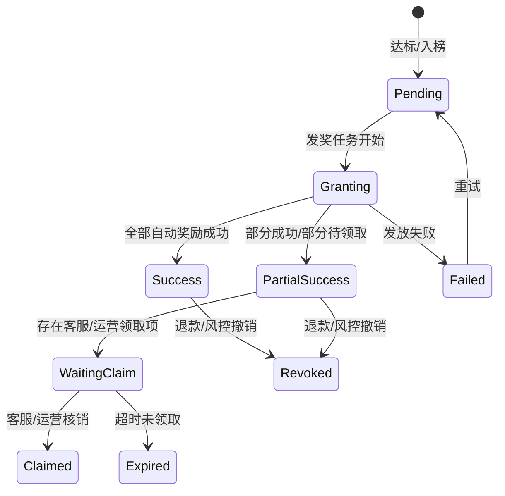

状态表：

| 状态 | 含义 | 用户通知 |
|---|---|---|
| Pending | 已获得资格，待发放 | 可不通知 |
| Granting | 发放中 | 可不通知 |
| Success | 已全部到账 | 通知奖励已到账 |
| PartialSuccess | 部分到账，部分待领取 | 通知自动奖励到账 + 联系客服 |
| WaitingClaim | 待客服/运营核销 | 通知领取方式 |
| Claimed | 已人工核销 | 通知领取成功 |
| Failed | 发放失败 | 不建议直接吓用户，后台告警 |
| Expired | 领取过期 | 通知资格过期 |
| Revoked | 已撤销 | 视风控策略通知 |

---

### 14.14 建议十四：补退款/撤销/风控处理规则

充值活动一定会遇到退款、刷榜、异常金币。

不写就是等死。

建议补：

| 场景 | 累计充值处理 | 奖励处理 | 榜单处理 |
|---|---|---|---|
| 周期内退款，奖励未发 | 扣减累计 | 不发 | 实时榜单更新 |
| 周期内退款，奖励已发 | 扣减累计 | 按规则追回/冻结/人工处理 | 实时榜单更新 |
| 周期结束后退款，排行已发 | 不改历史快照或标记异常 | 进入风控追回 | 历史保留，标记风控 |
| 风控判定刷榜 | 清空活动数据 | 取消资格 | 从榜单移除或标记 |
| 金币到账失败/回滚 | 不计入 | 不发 | 不上榜 |

建议补充文案：

```text
如用户充值订单发生退款、撤销或被风控判定无效，相关金币到账事件不计入活动累计。
若奖励已发放，则根据奖励类型执行自动追回、冻结或人工审核处理。
对于已冻结的历史榜单快照，系统保留原始排名记录，并追加风控处理状态，不直接物理删除快照。
```

---

### 14.15 建议十五：补页面刷新策略，别让用户以为没到账

现在写“榜单每小时刷新一次”。

但档位奖励又是立即发。

建议拆开：

| 数据 | 刷新策略 | 原因 |
|---|---|---|
| 我的累计充值 | 页面进入 / 充值返回 / 手动刷新 / 收到到账事件后刷新 | 用户最关心 |
| 进度条 | 跟随我的累计充值即时刷新 | 防止达标不显示 |
| 档位奖励状态 | 发奖成功后刷新 | 防止重复点击 |
| Top3 达标榜 | 可分钟级刷新或事件刷新 | 竞争感强 |
| 周/月 Top20 榜单 | 每小时自动刷新 | 降低压力 |
| 倒计时 | 前端本地秒级倒计时 + 服务端校时 | 避免时间漂移 |
| 历史榜单 | 周期快照生成后刷新 | 稳定即可 |

建议补充文案：

```text
“每小时自动刷新”仅适用于周/月榜单 Top20 列表。
用户自身累计充值、进度条、档位达成状态、奖励到账状态应在页面进入、充值返回、手动刷新或发奖状态变化后即时刷新。
```

---

## 15. 可以直接替换进 PRD 的规则文案

下面这段可以直接复制进需求文档。

### 15.1 统计口径

```text
活动累计充值以有效金币到账事件为准，统计对象为金币接收方用户。
有效金币到账包括官方应用内充值到账金币，以及普通用户通过币商购买后到账的金币。
代理/币商账号自身因水晶充值、自买自卖、内部调账产生的金币到账，不计入活动累计充值，不参与档位奖励与排行榜。
退款、撤销、风控判定无效的金币到账事件不计入活动累计；若已计入，则需按风控规则回滚累计值并处理已发奖励。
```

### 15.2 周期口径

```text
活动所有统计、展示、倒计时、周期结算和奖励发放均以 UTC+3 为准。
所有统计窗口采用左闭右开区间：
日周期为 [当日 00:00:00, 次日 00:00:00)；
周周期为 [周一 00:00:00, 下周一 00:00:00)；
月周期为 [当月 1 日 00:00:00, 次月 1 日 00:00:00)。
如活动有效期与自然周期不完全重合，则实际统计窗口取二者交集。
```

### 15.3 分区口径

```text
活动按英语区、阿语区分区独立统计。
分区维度适用于充值奖励页、Top3 达标榜、周榜、月榜、排行奖励、历史榜单和后台数据统计。
用户活动分区以后台用户分区配置为准，不随前端语言切换实时变化。
若用户分区为空，则按后台兜底规则分配活动分区。
```

### 15.4 档位奖励口径

```text
同一用户在同一分区、同一周期、同一档位下，档位奖励最多发放一次。
当一次有效金币到账导致用户累计充值同时跨过多个未达成档位时，系统按档位从低到高依次发放所有新达成档位奖励。
档位达成后，系统仅对自动发放类奖励执行即时发放；Pretty ID、靓号、Banner、开机屏等定制或运营配置类奖励仅生成待领取/待处理资格，由客服或运营核销。
```

### 15.5 排行榜快照口径

```text
周榜、月榜在周期结束时生成不可变榜单快照。
倒计时结束后，前端切换至新周期展示；后端不得删除或覆盖上周期榜单数据。
排行奖励发放、历史榜单展示、客服查询和数据对账均以周期快照为准。
```

### 15.6 排行榜排序口径

```text
周榜/月榜按用户在当前周期、当前分区内的有效累计金币数降序排名。
若累计金币数相同，则按用户达到该累计值的时间升序排名；仍相同则按财富等级降序；仍相同则按 user_id 升序兜底。
```

### 15.7 Top3 达标榜口径

```text
Top3 达标榜按 period_type + period_id + region + tier_id 维度生成。
用户首次达到某档位门槛时，系统记录毫秒级首次达成时间。
Top3 展示当前档位下首次达成时间最早的前三名用户。
若首次达成时间相同，则按财富等级降序；仍相同则按达成时累计充值金额降序；仍相同则按 user_id 升序兜底。
```

---

## 16. 最终建议：这份需求应该怎么重构

别在原文上东补一块西补一块。

建议按下面结构重写，不然还是一坨散沙。

| 章节 | 应写内容 |
|---|---|
| 1. 活动概述 | 活动目标、入口、默认页、时区、活动有效期 |
| 2. 用户分区规则 | 英语区/阿语区来源、展示、统计、发奖影响 |
| 3. 统计口径 | 有效金币到账、币商、代理、退款、风控 |
| 4. 周期规则 | 日/周/月左闭右开时间、活动有效期交集 |
| 5. 充值奖励页 | 页面字段、周期切换、进度条、档位节点 |
| 6. 档位奖励规则 | 档位表、跨档、幂等、自动/人工发放 |
| 7. Top3 达标榜 | 维度、首次达成时间、排序、展示状态 |
| 8. 周/月排行榜 | Top20、我的排名、排序、倒计时、快照 |
| 9. 排行奖励 | Top1/Top2-3/Top4-8、发奖时间、失败处理 |
| 10. 历史榜单 | 近 3 周/月、Top8/本人排名、发奖状态 |
| 11. 通知规则 | 自动到账、待领取、失败、撤销通知 |
| 12. 后台与客服 | 快照查询、发奖记录、人工核销、风控处理 |
| 13. 异常场景 | 退款、撤销、刷榜、分区变更、活动配置变更 |
| 14. 数据埋点 | 页面访问、充值点击、档位达成、发奖成功 |

一句话：

```text
先把钱和排名规则写死，再写页面。
页面只是壳，充值活动真正值钱的是统计、快照、发奖和风控。
```
